## Features - Usage and Testing

 <strong>xxx</strong>

<h2 align="center">

</h2>

## Features

## The Production Features

### User Management and Registration
Description: The admin and superadmin can register new Users and change their Permissions at any time. 

- Use Case: Register Users 

  Action: Access User Registration from the Crew/Cast Management tab to find a Permissions select menu. 
  Result: Registration page opens with the select menu on display. 

  Action: Register the User by selecting a Permission and enter a Username and Password for the User. 
  Result: The User receives an email with the Project URL along with their Username and Password. 

 <strong>xxxxxxxxxxxxxxx</strong>

<h2 align="center">
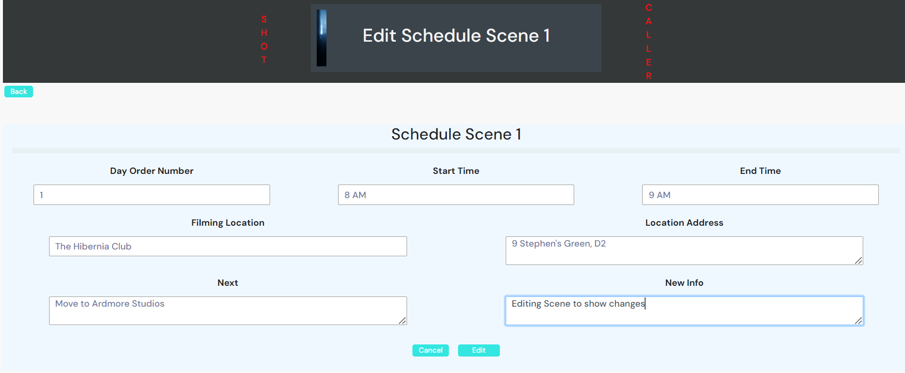
</h2>

 <strong>xxxxxxxxxxxxxxxxxxxx</strong>

<h2 align="center">
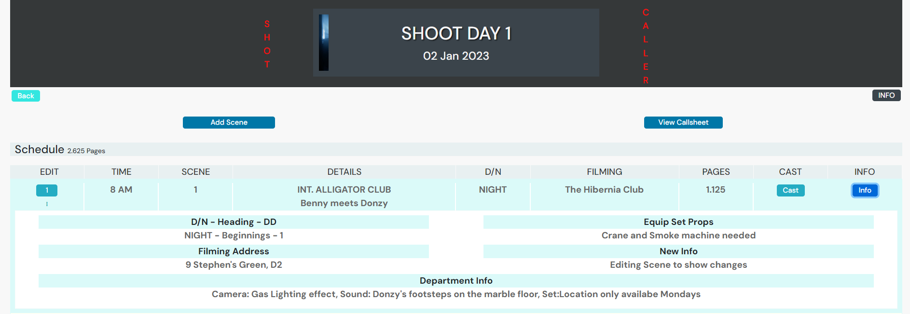
</h2>

- Use Case: Change a User's Permission 

  Action: Change the User's Permission by selecting a new Permission for the User. 
  Result: The User receives an email advising them of their new Permission. 

 <strong>xxxxxxxxxxxxxxxxx</strong>

<h2 align="center">

</h2>

 <strong>xxxxxxxxxxxxxxxx</strong>

<h2 align="center">

</h2>

### Scheduling
Description: View Schedules for a Shoot Day. Create Schedules by Creating Days then selecting Scenes from a menu which automatically adds the Scene's breakdown info to a stripboard. 

- Use Case: View all Shoot Days. 

  1. Click on the Schedule link in the Home page or from the Navbar. 
  2. The Schedule page displays with all the Shoot Days. 

 <strong>The Schedule page</strong>

<h2 align="center">
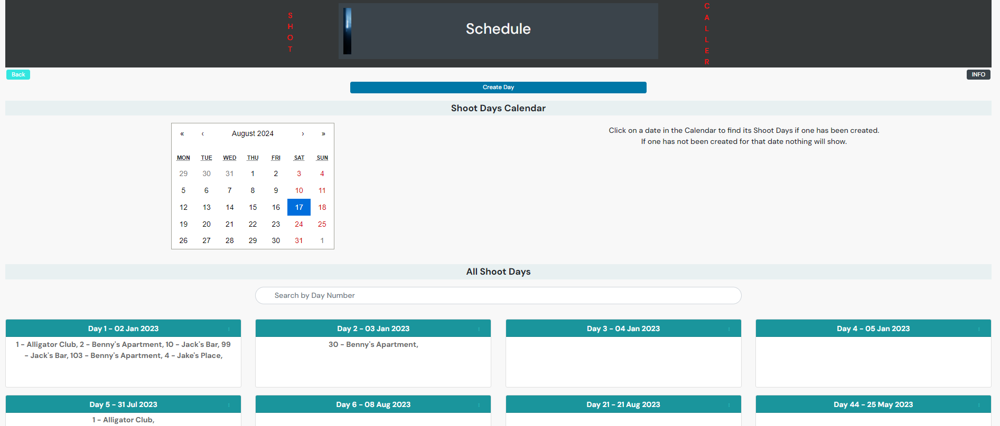
</h2>

- Use Case: Create a Shoot Day. 

  1. On the Schedule page click on the "Create Day" tab. 
  2. The Create Day form displays.  
  3. Add the Day number - "6". 
  4. Select the Date from the input box Calender - "20 Nov 2024". 
  5. The Date is added. 
  6. Press submit. 
  7. A success message displays. 
  8. The Shoot Day number "6" and Date "20 Nov 2024" is created and added to the page. 

 <strong>Shoot Day: Number "6" Created</strong>

<h2 align="center">

</h2>

- Use Case: Edit a Shoot Day. 

  1. On the Edit/Delete icon and click the Edit icon. 
  2. The Edit Day form displays.  
  3. Input the new details, i.e. change the date to - "27 Nov 2024". 
  6. Press submit. 
  7. A success message displays. 
  8. The Shoot Day number "6" displays with the new Date "27 Nov 2024". 

 <strong>Success Message and Day with changes</strong>

<h2 align="center">
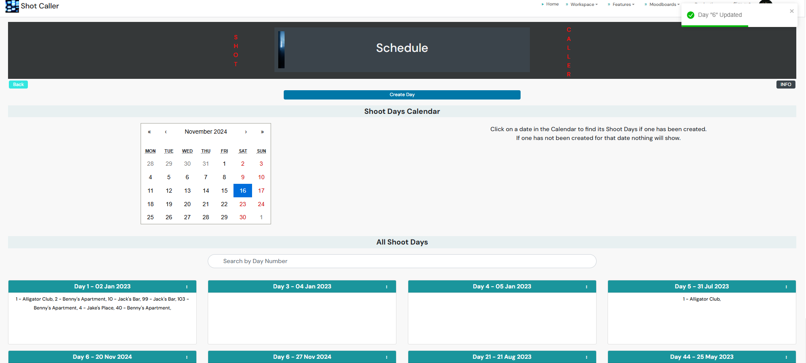
</h2>

- Use Case: Delete a Shoot Day. 

  1. On the Edit/Delete icon and click the Delete icon. 
  2. A Modal displays asking to Confirm Delete or Cancel 
  3. Click "Delete". 
  6. A success message displays and the Day is deleted. 

 <strong>Success Message and Day Deleted</strong>

<h2 align="center">
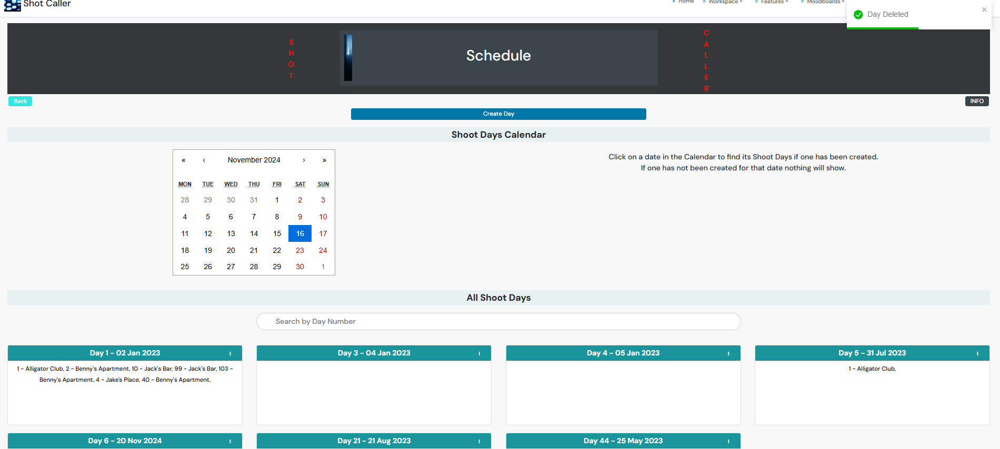
</h2>

- Use Case: Find a Shoot Day in the Calender. 

  1. Click on the desired date in the Calender - "02 Jan 2023". 
  2. The Shoot Day opens if one has been created for that date.  

 <strong>Shoot Day "02 Jan 2023"</strong>

<h2 align="center">
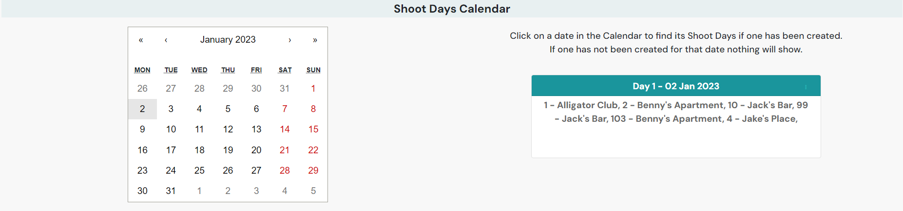
</h2>

- Use Case: Find a Shoot Day from the Search Bar. 

  1. Enter the Day Number "1" in the Search Bar and Submit. 
  2. The search returns Days containing the number "1". 

 <strong>The Shoot Day "1" displays.</strong>

<h2 align="center">
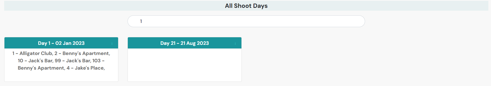
</h2>

- Use Case: View the Shoot Day and its Stripboard. 

  1. Click on the Shoot Day from the the selection displaying on the page or from the one if returned from the Calender search or Search Bar. 
  2. The Shoot Day opens and the Add Scenes tab and Stripboard displays.  

 <strong>The Shoot Day with the Add Scenes tab and Stripboard</strong>

<h2 align="center">
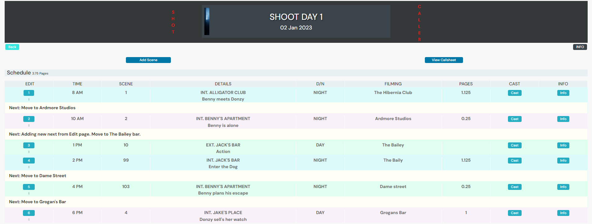
</h2>

- Use Case: Add Schedule Scenes to a Shoot Day. 

  1. Click on the Shoot Day. 
  2. The Shoot Day opens with the Add Scenes tab and Stripboard.  
  3. Click the the Add Scene tab. 
  4. The Add Scene form opens below. 
  5. Click on the Act One tab and the Scenes from Act One display. 
  6. Click on the Act Two A tab and the Scenes from Act Two A display. 
  7. Click on the Act Two B tab and the Scenes from Act Two B display. 
  8. Click on the Act Three tab and the Scenes from Act Three display. 
  9. Click on the Location tab and the Scenes display by Location. 
  10. Input a Scene number, Title or Location to the Search Bar then click one of the above tabs and the Scenes in that tab group with the search value display. 
  11. Select a Scene by clicking on it and the Shooting Info form opens below with the Scene numberon top. 
  12. Input the Day Order Number and other values and press Add Scene. It is up to the User to input an
   unused Day Order Number not used in another Scene. 
  13. A success message displays.
  14. The Schedule Scene is added to the Stripboard and the page count is updated by Scene 4's length of 1 to 3.75. 

 <strong>Add Scene Form</strong>

<h2 align="center">
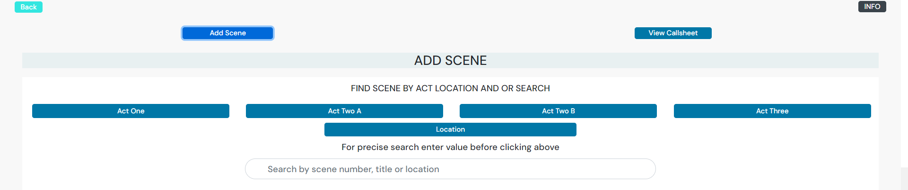
</h2>

 <strong>Act One Scenes displaying after clicking the Act One tab</strong>

<h2 align="center">
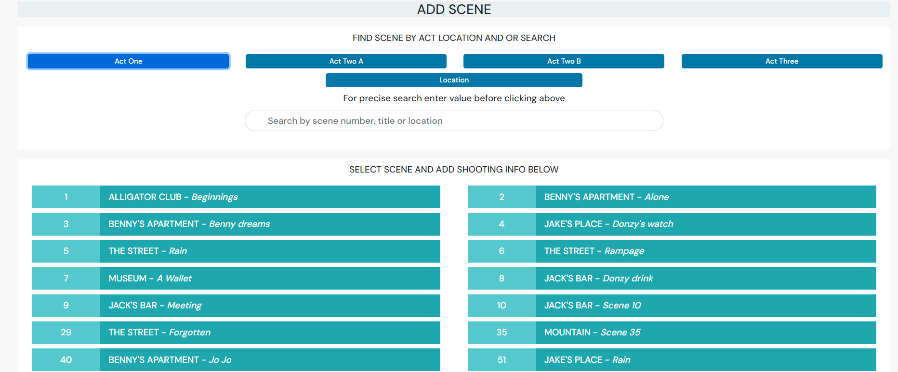
</h2>

 <strong>Enter value "Jake" in Search bar</strong>

<h2 align="center">
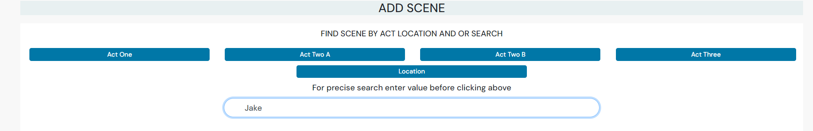
</h2>

 <strong>Act One Scenes with Location Jake display</strong>

<h2 align="center">
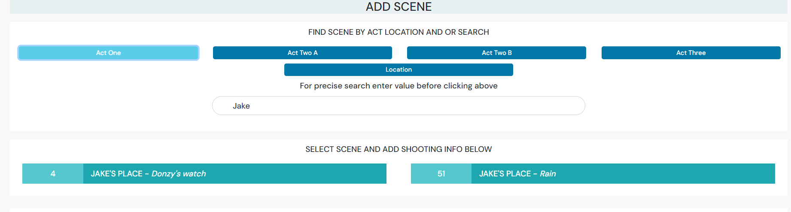
</h2>

 <strong>Enter Shooting Info with Day order Number "6" and submit form</strong>

<h2 align="center">
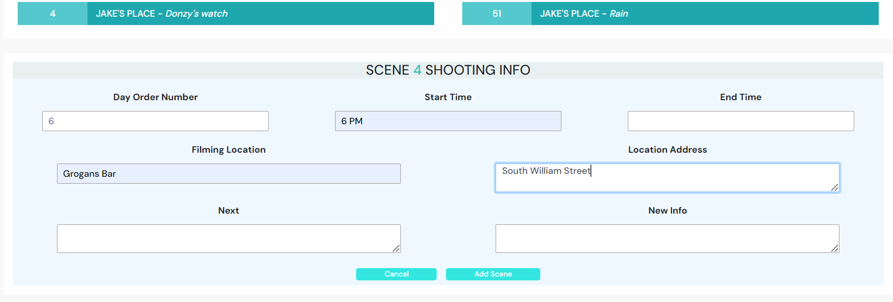
</h2>

 <strong>Scene 4 is added to the Stripboard with Day order number "6"</strong>

<h2 align="center">
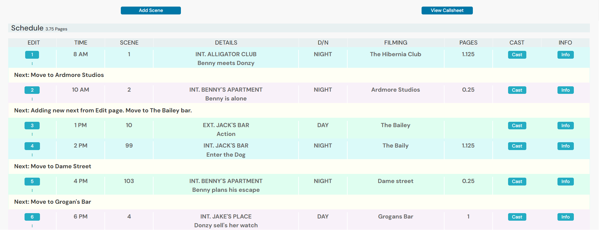
</h2>

- Use Case: Edit Schedule Scene 

  1. Click on the three Dots edit icon to open the Edit/Delete mini menu and click Edit. 
  2. The Edit page opens with the fetched Schedule Scene info in the input boxes 
  3. Make changes and click Edit. 
  4. The Stripboard opens with the changes to that Schedule Scene. 

 <strong>Make changes to New Info field</strong>

<h2 align="center">

</h2>

 <strong>Stripboard after submitting</strong>

<h2 align="center">

</h2>

- Use Case: Add a Next row with move or break info below a Schedule Scene. 

  1. Click on the three Dots edit icon to open the Edit/Delete mini menu and click Edit. 
  2. The Edit page opens with the fetched Schedule Scene info in the input boxes 
  3. Input the new Next info in the Next input box and click Edit. 
  4. The Stripboard opens with the new next Row displaying below that Schedule Scene. 

 <strong>Make changes to Next field</strong>

<h2 align="center">
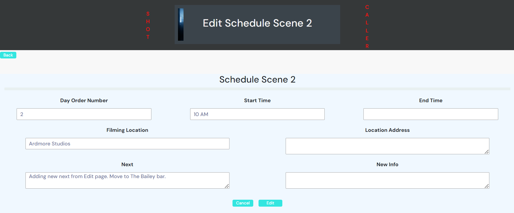
</h2>

 <strong>Stripboard after submitting</strong>

<h2 align="center">
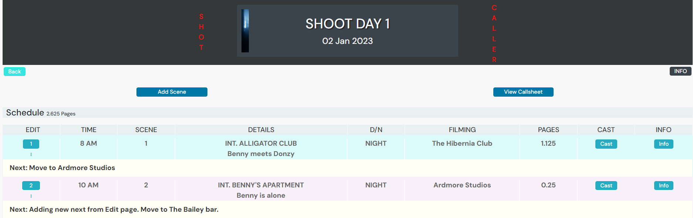
</h2>

- Use Case: Reorder a Schedule Scene. 

  1. Click on the Reorder button which currently displays the Scene's current order and the reorder form opens. 
  2. Input the new Order number and click Reorder. 
  3. The Stripboard opens with the new Order number for the Schedule Scene. 
  4. Re-order all the following Schedule Scenes in a similar manner. 

 <strong>Make changes to Reorder field</strong>

<h2 align="center">
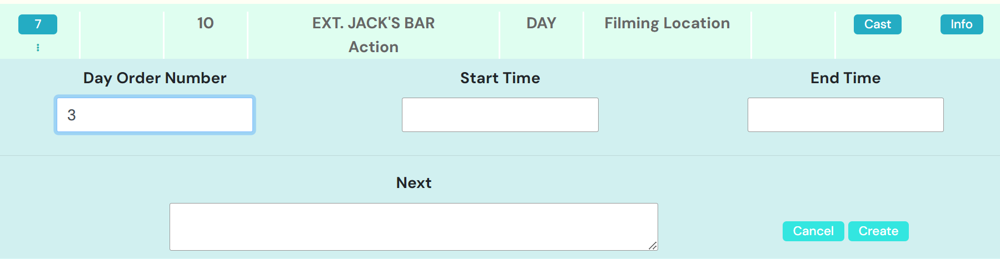
</h2>

 <strong>Stripboard after submitting</strong>

<h2 align="center">
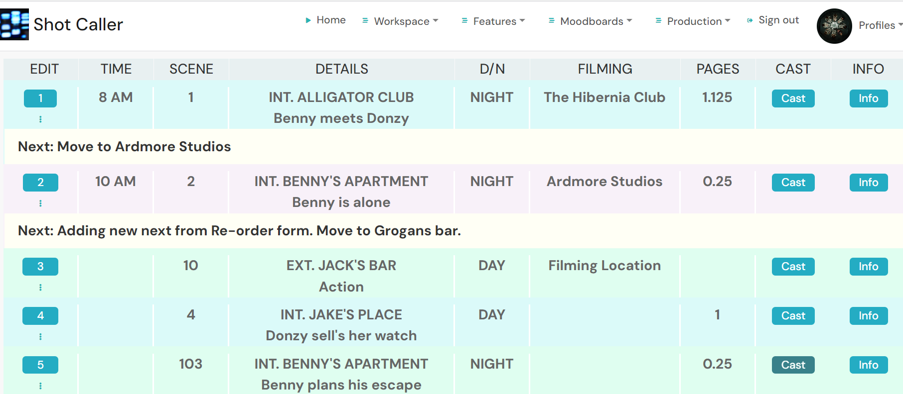
</h2>

- Use Case: Add a Next row with new info below a Schedule Scene from the Reorder form. 

  1. Click on the Reorder button and the reorder form opens. 
  2. Input the new Next info in the Next input box and click Create. 
  3. The Stripboard opens with the new next Row displaying below that Schedule Scene. 

 <strong>Make changes to Next field</strong>

<h2 align="center">
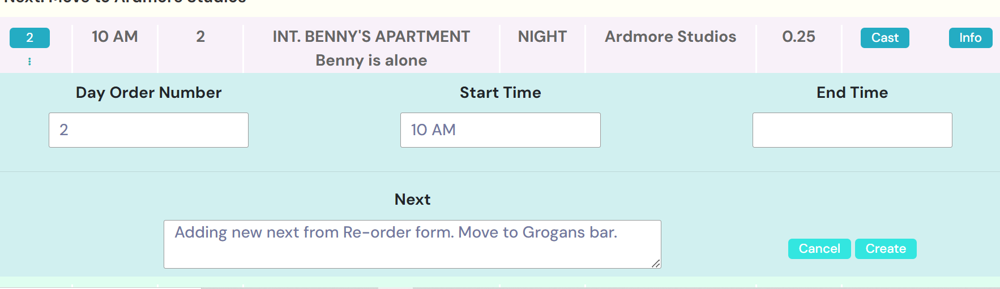
</h2>

 <strong>Stripboard after submitting</strong>

<h2 align="center">
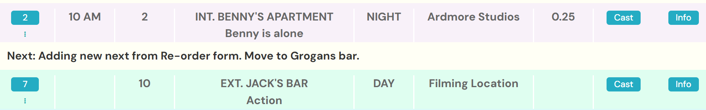
</h2>

- Use Case: View the Schedule Scene Characters. 

  1. Click on the Cast button. 
  2. The Cast Info displays below. 

 <strong>Character Info</strong>

<h2 align="center">
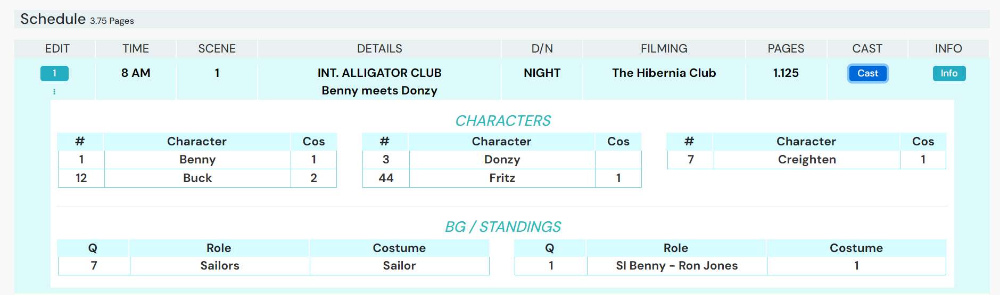
</h2>

- Use Case: View the Schedule Scene Info. 

  1. Click on the Info button. 
  2. The Info displays below. 

 <strong>Scene Info</strong>

<h2 align="center">
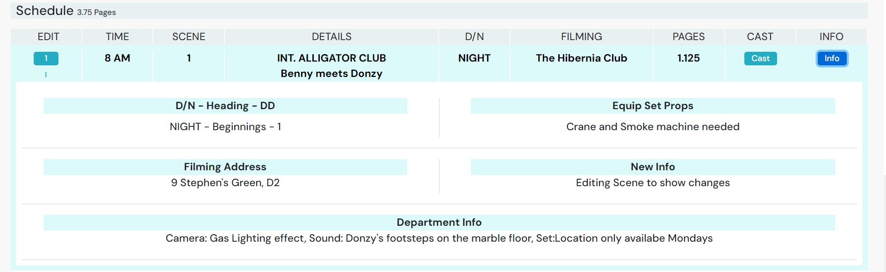
</h2>

### Callsheets
Description: xxxx 

### Budgeting 
- As this feature is held on the "Shot Caller Production" home app the Budgeting testing is on it's Testing page. [Testing](https://github.com/johnston9/shot-caller-production/blob/main/TESTING.md) 

## The Creative Features

### Scenes Workspace
Description: View and create Scene pages containing Breakdowns, Characters and Background, Scripts, Storyboards, Shotlists, and Workspaces. 

#### Scenes Page
Description: This page displays all the currently added Scenes and the "Script" tab to the Script page where the whole Script can be uploaded and viewed.

- Use Case: View all the Scenes 

  1. Click on Scenes Workspace on the Home page or Workspace in the Navbar. 
  2. The Scenes Workspace page opens with all the currently created Scenes displaying on it. 

 <strong>Scenes Workspace</strong>

<h2 align="center">
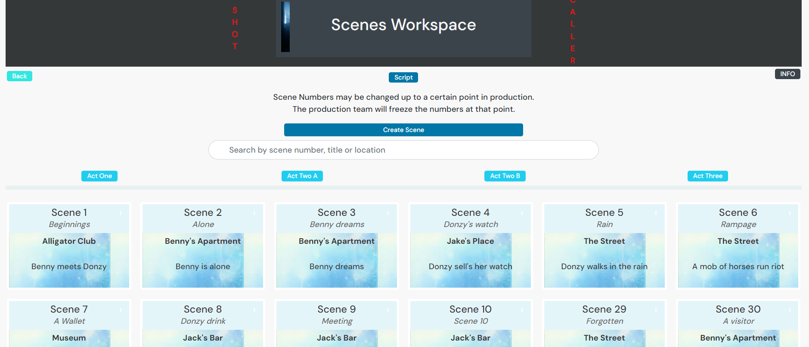
</h2>

- Use Case: Find Scenes from the Searchbar 

  1. On the Scenes Workspace start typing a Scene Number, Title or Location in the Searchbar, e.g. for Location start typing "Alligator Club". 
  2. Results will display narrowing down with each charactor or digit typed. 
  3. In this case by the time "alli" is typed in the results for Location "Alligaror Club" display.

 <strong>Alligaror Club returned from Search</strong>

<h2 align="center">
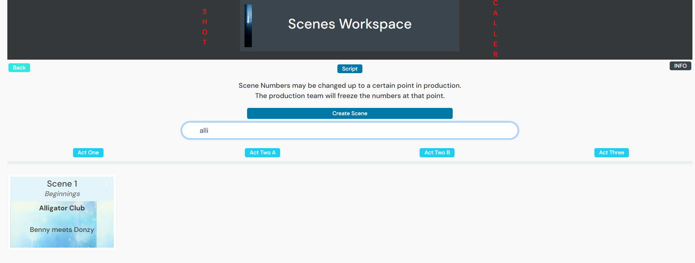
</h2>

- Use Case: Find Scenes by Act or Location List 

  1. On the Scenes Workspace click on the "Act Three" tab.. 
  2. Results showing all scenes from Act Three display. 

 <strong>Act Three</strong>

<h2 align="center">
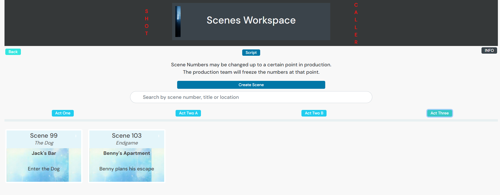
</h2>

- Use Case: Create a Scene 

  1. In the Scenes Workspace page click on the "Create Scene" tab to open the "Create Scene" form. 
  2. Input the new Scene Number, "11", and submit. 
  3. Scene "11" is added to the Scenes Workspace.
  4. A Success message displays saying "Scene 11 Created".

 <strong>Input "11" in the Create Scene form</strong>

<h2 align="center">
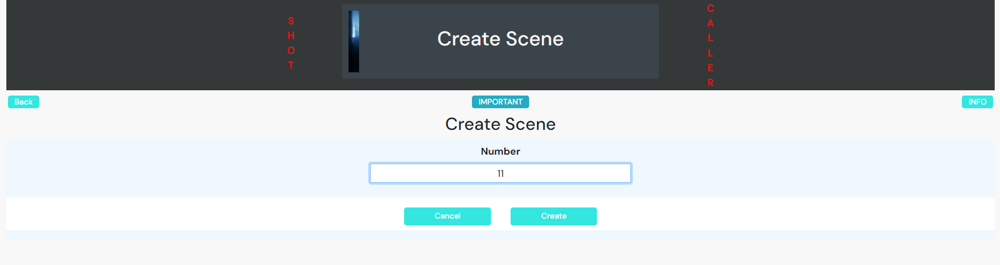
</h2>

 <strong>Success Message</strong>

<h2 align="center">
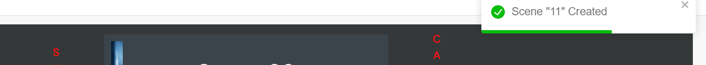
</h2>

 <strong>Scene "11" added to Workspace</strong>

<h2 align="center">
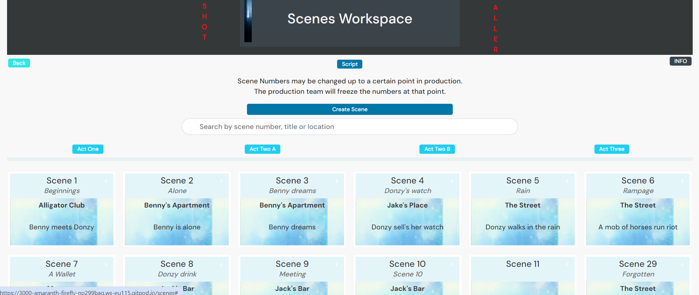
</h2>

- Use Case: Delete a Scene on the Scenes page. 

  1. On the Scenes page click the Edit/Delete icon on the Scene Top then click the Delete icon. 
  2. A Modal displays asking to Confirm Delete or Cancel 
  3. Click "Delete". 
  6. A success message displays and the Scene is deleted. 

 <strong>Success Message and Scene Deleted</strong>

<h2 align="center">
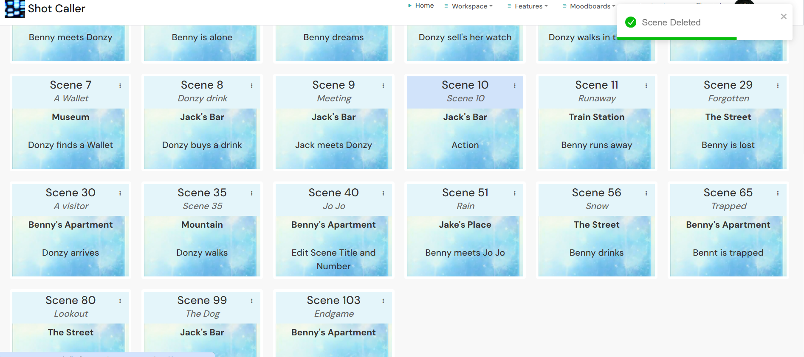
</h2>

- Use Case: Delete a Scene on it's Scene page. 

  1. On the Scene click the Edit/Delete icon then click the Delete icon. 
  2. A Modal displays asking to Confirm Delete or Cancel 
  3. Click "Delete". 
  6. A success message displays and the Scene is deleted. 

#### Script
Description: This page contains the whole script. It also had "Latest Changes" and "Notes" information sections on top and an "Add Latest Script" tab where the latest draft can be uploaded. 

- Use Case: View the Script 

  1. Click on the "Script" tab on the Scenes page. 
  2. The Script page opens displaying the current Script with the "Latest Changes" and "Notes" information sections on top and an "Add Latest Script" tab.

 <strong>The Script page</strong>

<h2 align="center">
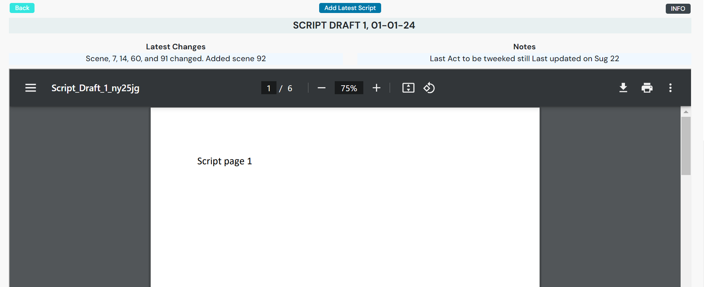
</h2>

- Use Case: Add the first Script Draft along with Notes 

  1. Click on the "Add Script" tab on the Scenes page. This will display is a Script has not been previously been added, if it has an "Add Latest Script" tab will display.
  2. The "Add Script" form opens.
  3. Input the "Draft Name" info.
  4. Input the "Latest Changes" info if desired."
  5. Input the "Notes" info."
  6. Click the "Change the Script" tab to open the Desktop files and select the desired file to be uploaded.
  7. The new file is added with its desktop name displaying below.
  8. Click Upload and the updates are added to the database and the Scenes page opens.
  9. A Success message displays.
  9. Click Script to view the Script.

- Use Case: Add the Latest Draft along with the Latest Changes and Notes inputs 

  1. Click on the "Add Latest Script" tab on the Scenes page.
  2. The "Add Latest Script" form opens displaying the current database Script file name, "Script_Draft_1_ny25jg" and the current draft, latest changes and notes inputs.
  3. Input the new "Draft Name" info, - "Draft 4, 02-04-24".
  4. Input the new "Latest Changes" info, - "Scene, 1, 2 and 3 changed. Added scene 94."
  5. Input the new "Notes" info, - "Scene 1 is 1.5 pages longer now."
  6. Click the "Change the Script" tab to open the Desktop files and select the desired file to be uploaded, - "Script Draft 4".
  7. The new file is added with its desktop name displaying below, - "Script Draft 4.pdf".
  8. Click Upload and the updates are added to the database and the Scenes page opens.
  9. A Success message displays saying "Script Draft 4.pdf" added.
  9. Click Script to view the changes including its new database file name "Script_Draft_4_v5omzy".

 <strong>The "Add Latest Script" Form with the Changes</strong>

<h2 align="center">
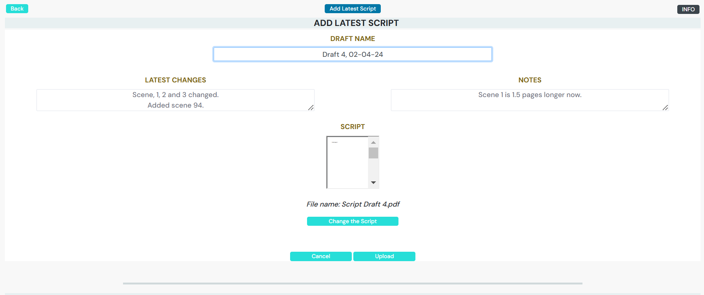
</h2>

 <strong>Success Message</strong>

<h2 align="center">
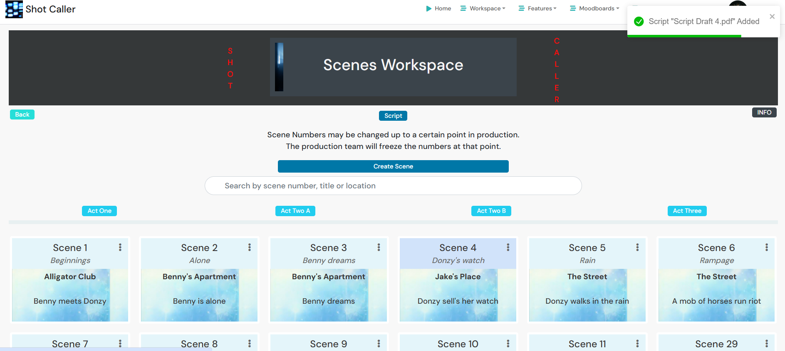
</h2>

 <strong>The new Script and the new info</strong>

<h2 align="center">
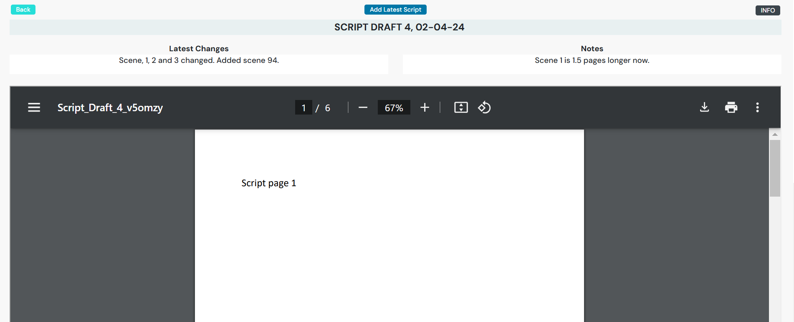
</h2>

- Use Case: View the Script in it's original format 

  1. Click on the "Click here to View the Original Script file" link on the Script page. 
  2. The Script opens on a new page in its original PDF format.

  - Use Case: Download the Script 

  1. Click on the "Download" icon on the Script. 
  2. The Script is downloaded. 

 - Use Case: Print the Script 

  1. Click on the "Print" icon on the Script. 
  2. The Print menu opens. 
  3. Click Print and the Script is printed out. 

#### Scene Page
Description: This page contains the Breakdown, Characters and Background, Scene Script, Storyboard, Shotlists, and Workspaces. 

- Use Case: View the Scene Page 

  1. Click on a Scene on the Scenes page.
  2. The Scene page opens.

#### Scene Breakdown
Description: This section contains the Scene Breakdown.

- Use Case: View the Scene Breakdown 

  1. Click on Breakdown tab on the Scene page to view the Scene Breakdown.

- Use Case: Add/Edit details in the Breakdown 

  1. Click on the 3 Dots on the Scene page or the Add/Edit tab on the Breakdown page to open the Add/Edit Breakdown form.
  2. Fill in the details.
  3. If the Location is not already added to the Locations dropdown click the "Add new Location" tab on the top of the page to open the Add New Location form.
  4. Input the new location "Train Station" and submit.
  5. The new Location "Train Station" is now added to the Locations dropdown.
  6. Add the Scene Script by selecting the desired PDF file "S 11 No 2 Script" from the desktop.
  7. Add the Scene Storyboard by selecting the desired PDF file "S 11 Storyb" from the desktop.
  8. Submit the form.
  9. A Success message displays saying "Scene "11" Breakdown Updated".
  10. Click on Breakdown tab on the Scene page to view the new Breakdown inputs.

 <strong>Add New Location</strong>

<h2 align="center">

</h2>

 <strong>New Location in Dropdown</strong>

<h2 align="center">
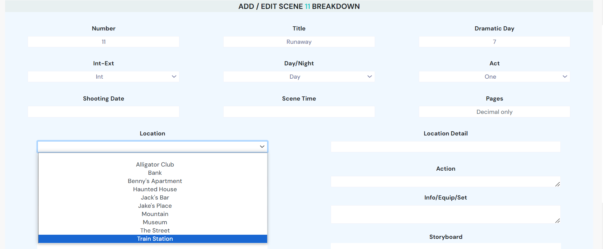
</h2>

 <strong>Input Breakdown Fields</strong>

<h2 align="center">
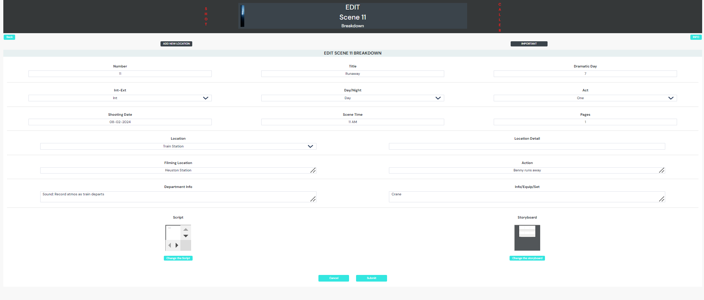
</h2>

 <strong>Success Message</strong>

<h2 align="center">
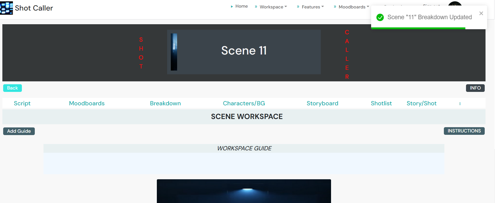
</h2>

 <strong>The Breakdown Page</strong>

<h2 align="center">
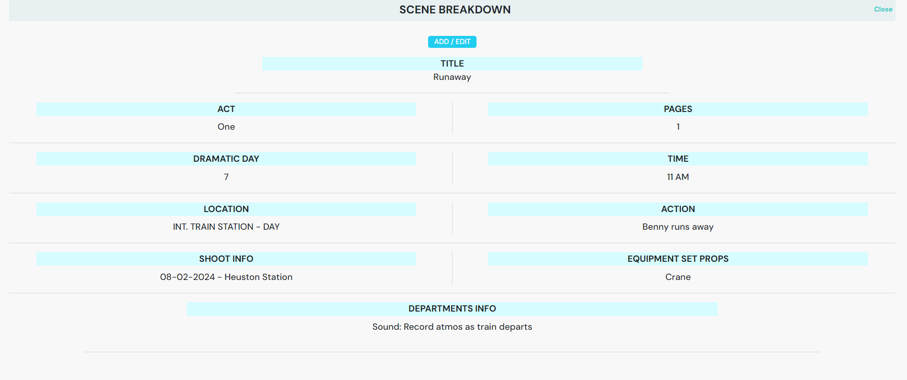
</h2>

- Use Case: Add/Edit details in the Breakdown from the Scenes page 

  1. Click on the 3 Dots on the Scene Top on the Scenes page to open the Add/Edit Breakdown form.
  2. Fill in the details and submit.
  3. A success message displays and the Scene it updated with the new details.

#### Scene Characters/Bg
- Description: This section contains the Scene's Characters and Background information. Admin can add/edit Scene Characters and BG here. Characters are added by a dropdown containing all Characters added to the Project. Selecting a Character automatically fills it's Role and Number input. 
Characters can be added to the Project on the "Add Character" form in the "Characters" feature or here in the "Add New Characters "form.

- Use Case: View the Scene Characters/Bg Section 

  1. Click on Characters/Bg tab on the Scene page to view the Scene Characters/Bg Section with the currenly added Characters and Background.

 <strong>The Characters/Bg Section</strong>

<h2 align="center">
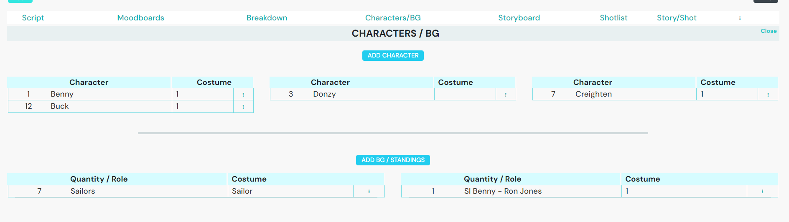
</h2>

- Use Case: Add New Characters for the Project 

  1. Click on "Add Character" tab on the Characters/Bg Section to open the "Add Characters" form. 
  2. Click on "Add New Characters" tab to open the Add New Characters form. 
  3. Enter the "Role" name - "Fritz". 
  4. Select a Character number from one of the three inputs boxes. 
    Clicking on "Number 1 - 30" opens a dropdown with all the current unused "1 - 30" Numbers. 
    Clicking on "Number 31 - 100" opens a dropdown with all the current unused "31 - 100" Numbers. 
    Clicking on "Number 101 - 200" opens a dropdown with all the current unused "101 - 200" Numbers. 
    Select Number "44" from the "Number 31 - 100" dropdown. 
  5. Click "Create" and the Character Fritz is added to the database with a Character Number of "44" and the form is cleared. 
  6. A success message displays saying "Character Fritz Aded". 

 <strong>Open the "Add New Characters" form and add Role "Fritz"</strong>

<h2 align="center">
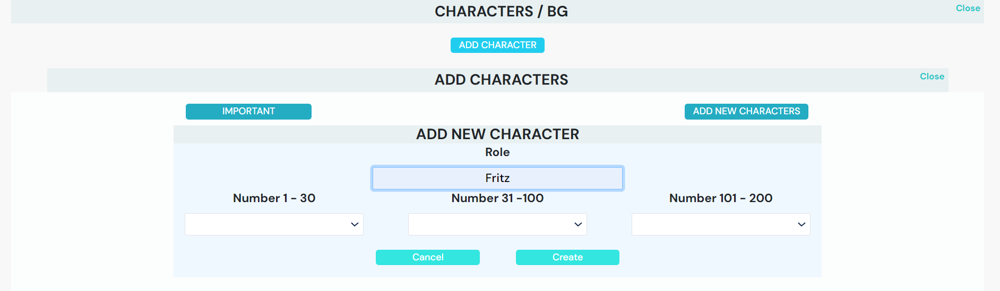
</h2>

 <strong>Select number "44" from the "Number 31 - 100" dropdown.</strong>

<h2 align="center">
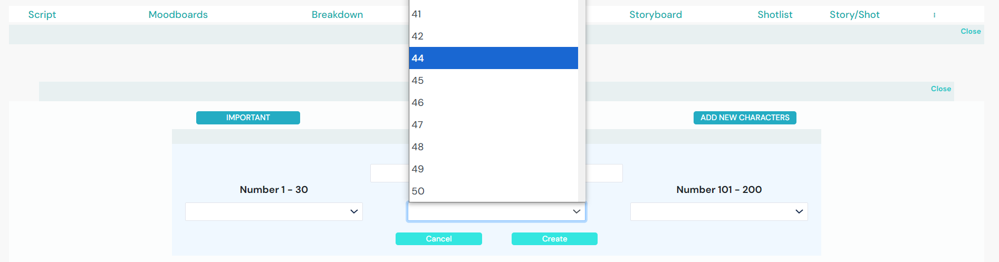
</h2>

 <strong>Success Message</strong>

<h2 align="center">
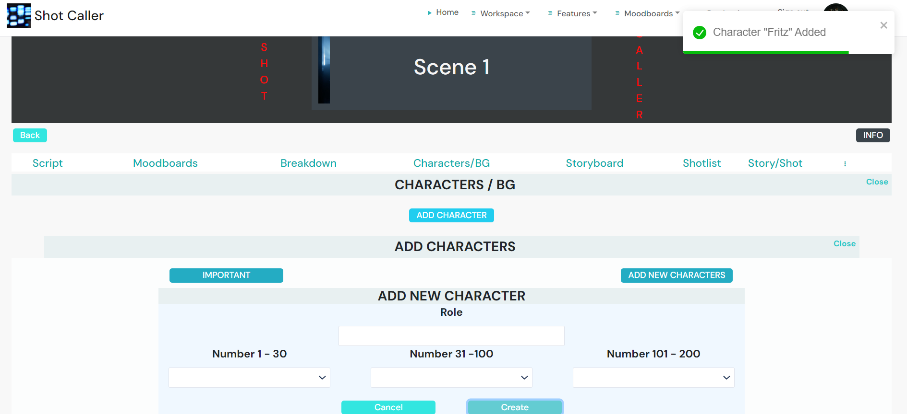
</h2>

 <strong>The Character Fritz is added to the project with a Number of "44"</strong>

<h2 align="center">

</h2>

- Use Case: Add Characters to the Scene 

  1. Click on "Add Character" tab on the Characters/Bg Section to open the "Add Characters" form which contains the "Add Scene Character" form below the "Add New Characters" tab. 
  2. Click on the "Select" button to open the scrollable Dropdown menu of currrently added Project Characters. 
  3. Click on "Fritz", the Character added in the Use Case above. 
  4. The Role and Number inputs are automatically filled with Fritz's info. 
  4. "Fritz" is added to the Scene Charcters below and the form is cleared to allow the next Character to be added. 
  5. A success message displays saying "Character Fritz Aded". 
  6. After the page is refreshed the Character "Fritz" will be displayed in ascending "Number" order like the rest of the Characters. 

 <strong>The "Add Characters" form</strong>

<h2 align="center">
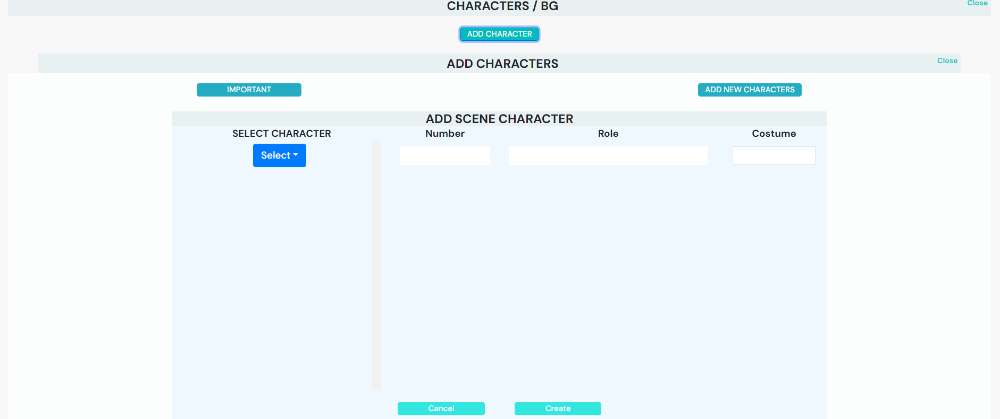
</h2>

 <strong>Click on "Fritz" in the Dropdown</strong>

<h2 align="center">
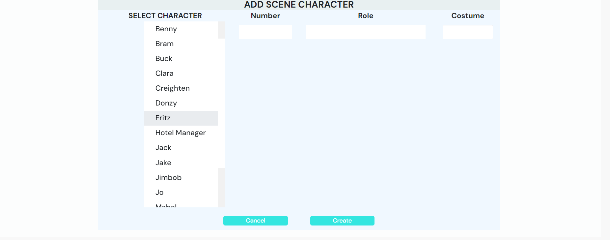
</h2>

 <strong>The Role and Number Inputs are Automatically filled with Fritz's Info</strong>

<h2 align="center">
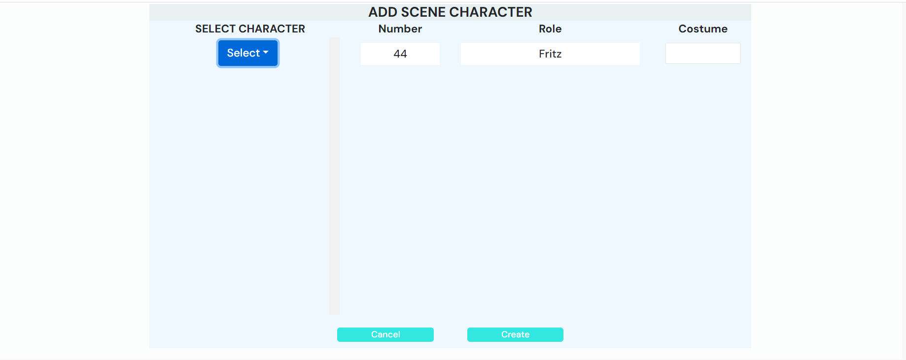
</h2>

 <strong>Success Message</strong>

<h2 align="center">
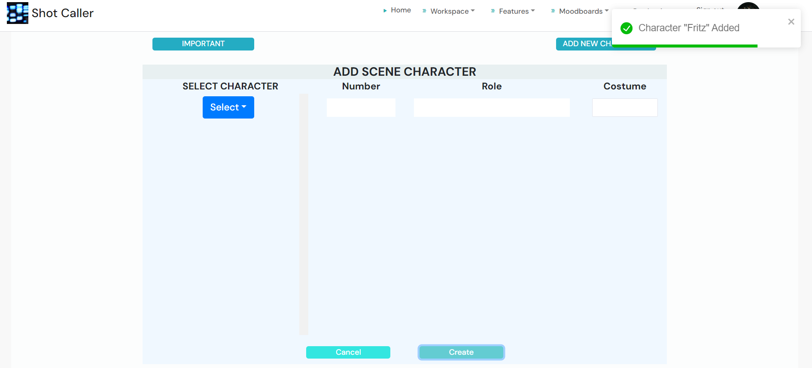
</h2>

 <strong>"Fritz" is added to the Scene Charcters Below</strong>

<h2 align="center">
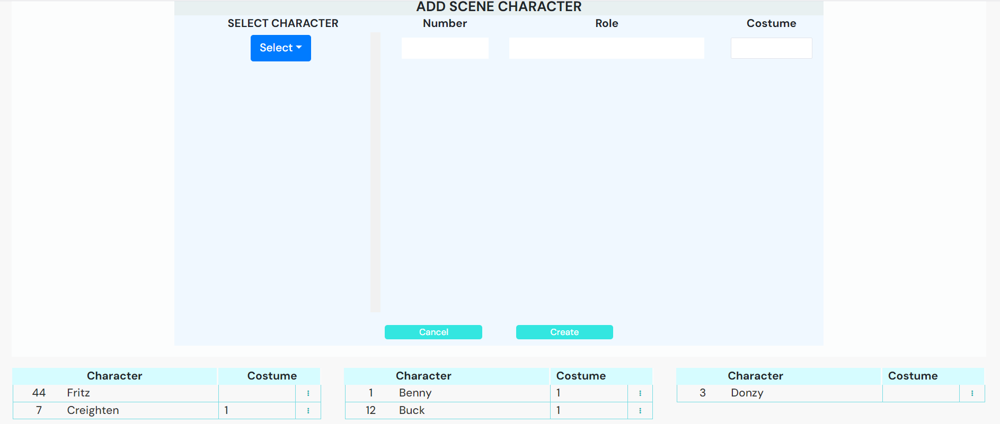
</h2>

 <strong>"Fritz" Displaying in correct Order after Refreshing</strong>

<h2 align="center">

</h2>

- Use Case: Delete Scene Characters 

  1. Click on "3 Dots Edit/Delete" icon to open the Edit/Delete mini menu and select Delete. 
  2. A pop-up displays on top of the page asking to confirm the Delete.
  3. Click "Cancel" to cancel or "Delete" to delete.

 <strong>The Edit/Delete mini menu</strong>

<h2 align="center">
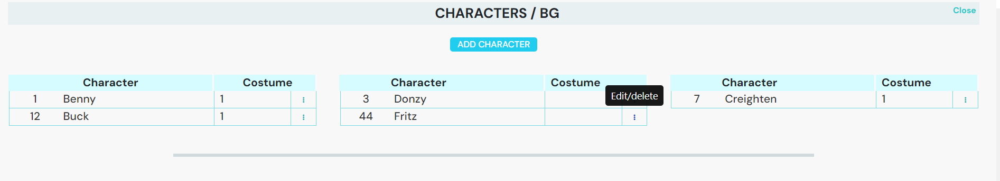
</h2>

 <strong>The Pop-up to Confirm Delete</strong>

<h2 align="center">
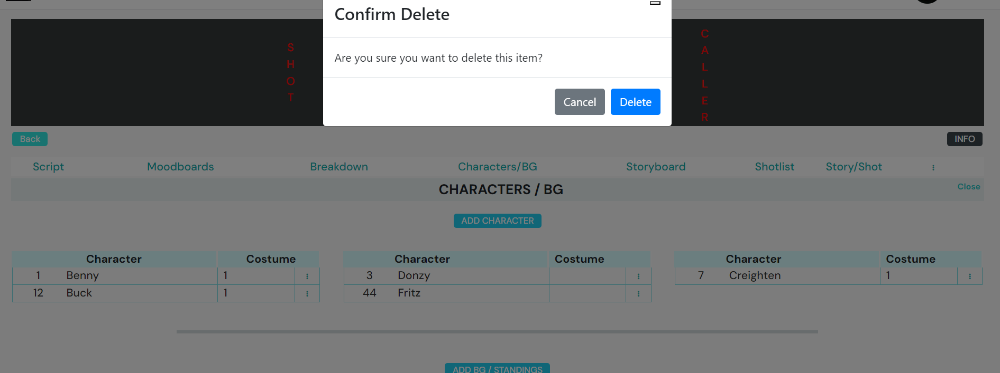
</h2>

- Use Case: Edit Scene Characters 

  1. Scene Characters' "Role" and "Number" fields cannot be edited but "Costume" can. See Scene Character Costume below. 

#### Scene Character Costume
Description: 
- Use Case: Edit Scene Characters' Costumes 

  1. Click on a character's, "3 Dots Edit/Delete" icon to open the Edit/Delete mini menu and select Edit, eg "Fritz". 
  2. The "Add/Edit Costume" form opens. 
  3. Enter a value "1" and submit. 
  4. The value "1" is added to Fritz Costume. 
  5. A success message displays saying - "Fritz's Costume Updated". 

 <strong>Value "1" Entered in "Add/Edit Costume" form</strong>

<h2 align="center">
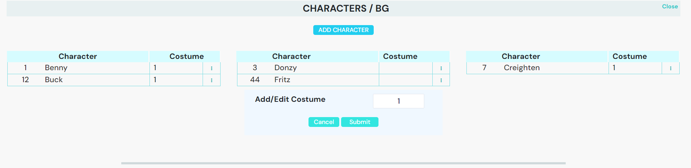
</h2>

 <strong>Value "1" added to "Fritz Costume"</strong>

<h2 align="center">
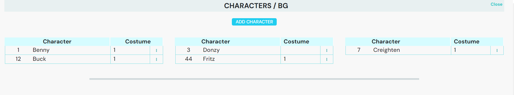
</h2>

 <strong>Success Message</strong>

<h2 align="center">
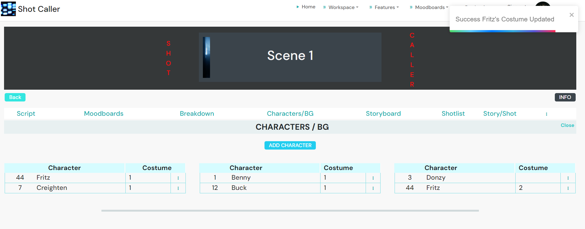
</h2>

- Use Case: Add BG/Standings to the Scene 

  1. Click on "Add BG/Standings" tab on the Characters/Bg Section to open the "Add BG/Standings" form . 
  2. Input the item, e.g. "7 Bar Drinkers" and submit.
  4. "7 Bar Drinkers" is added to the Scene BG/Standings below and the form is cleared to allow the next BG item to be added. 
  5. A success message displays saying "BG Bar Drinkers Added". 

 <strong>The "Add BG/Standings" form with inputs</strong>

<h2 align="center">
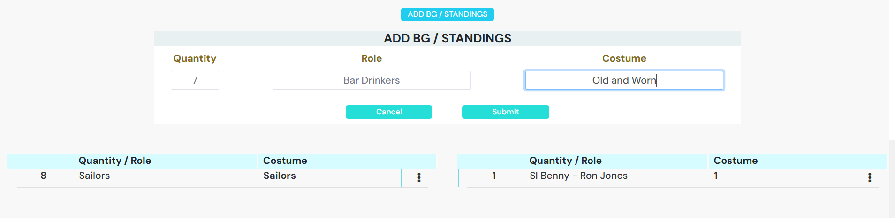
</h2>

 <strong>Success Message and "Bar Drinkers" added</strong>

<h2 align="center">
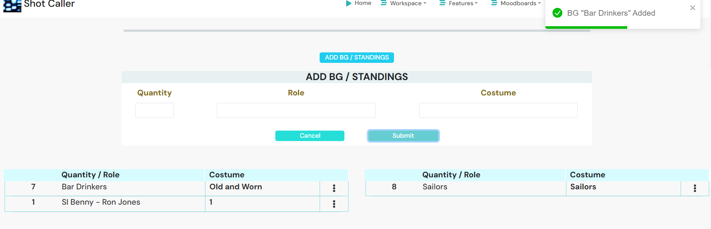
</h2>

- Use Case: Edit BG/Standings 

  1. Click on "3 Dots Edit" tab on a Characters/Bg item to open the Edit BG/Standings form . 
  2. Update the item, e.g. "8 Bar Drinkers" and submit.
  4. "7 Bar Drinkers" is updated to "8" 
  5. A success message displays saying "BG Bar Drinkers Updated". 

 <strong>The Changes</strong>

<h2 align="center">
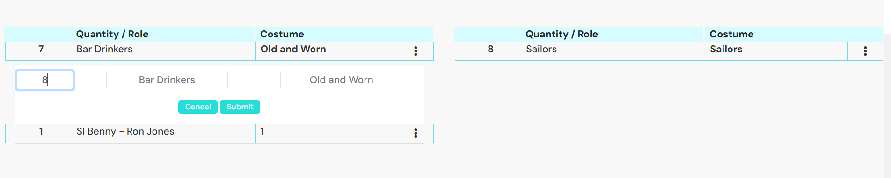
</h2>

 <strong>Success Message and "Bar Drinkers" Updated</strong>

<h2 align="center">

</h2>

- Use Case: Delete Scene BG/Standings 

  1. Click on the item "Bar Drinkers" "3 Dots Edit/Delete" icon to open the Edit/Delete mini menu and select Delete. 
  2. A pop-up displays on top of the page asking to confirm the Delete.
  3. Click "Cancel" to cancel or "Delete" to delete.
  4. The item "Bar Drinkers" is deleted.

 <strong>The Pop-up to Confirm Delete</strong>

<h2 align="center">
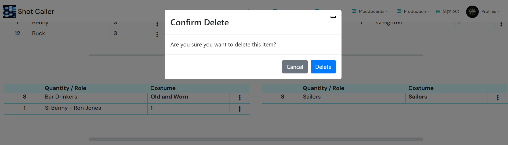
</h2>

 <strong>Bar Drinkers Deleted</strong>

<h2 align="center">
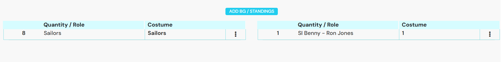
</h2>

#### Scene Script
Description: View, Download, Print or Change the Scene Script 

- Use Case: View the Scene Script 

  1. Click on Script tab on the Scene page to view the new Script "S 11 No 2 Script" added above. If no Script has been added yet a message will display advising to go to the Scenes Workspace page and click the Script tab on top to view the entire Script.

 <strong>Scene Script - "S 11 No 2 Script"</strong>

<h2 align="center">
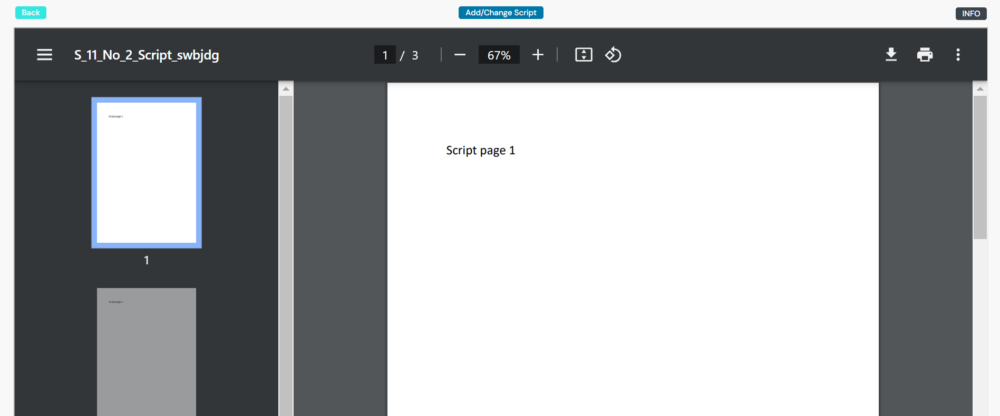
</h2>

- Use Case: View the Scene Script in it's original PDF format 

  1. Click on the "Click here to View the original Script file" link on the Script page.
  2. The Script opens in a new tab in it's original PDF format.

- Use Case: Download the Scene Script 

  1. Click on Download icon on the Script page.
  2. The Script is downloaded to the User's device.

- Use Case: Print the Scene Script 

  1. Click on Print icon on the Script page.
  2. The Script is printed out on the User's printer.

- Use Case: Add/Change the Scene Script 

  1. Click on Script tab on the Scene page to open the new Script "S 11 No 2 Script" added above.
  2. Click on the "Add/Change Script" tab.
  3. The Add/Change Script form opens with the "Database" name of the current Script "S_11_No_2_Script_swbjdg" displaying and a "Change Script" tab underneath.  If no Script has been added yet an "Upload Script" message will display instead.
  4. Click "Change Script" or "Upload Script" to open the Desktop files.
  5. Select the desired file "S 11 No 3 Script" and the "Desktop" name of the selected file "S 11 No 3 Script.pdf" displays in place of the previous "Database" one.
  6. Click Upload and the Script is changed in the backend.
  7. A success message displays saying - "S 11 No 3 Script Added". 
  8. Click Script tab to view the newly uploaded Script "S 11 No 3 Script" with the new database File name "S_11_No_3_Script_i8tapb" displaying.

 <strong>The "Add/Change Script" form displaying the current "Database" file name "S_11_No_2_Script_swbjdg"</strong>

<h2 align="center">
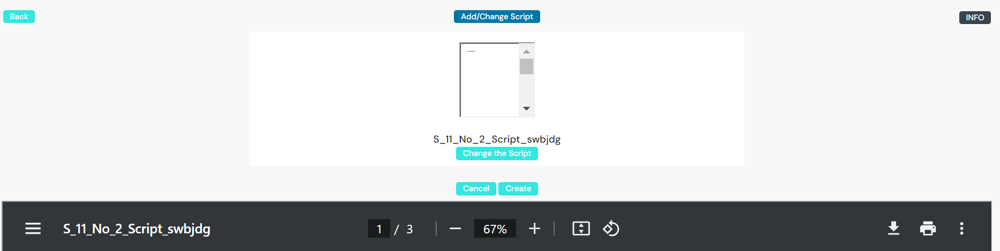
</h2>

 <strong>The "Add/Change Script" form displaying the new "Desktop" file name "S 11 No 3 Script.pdf"</strong>

<h2 align="center">
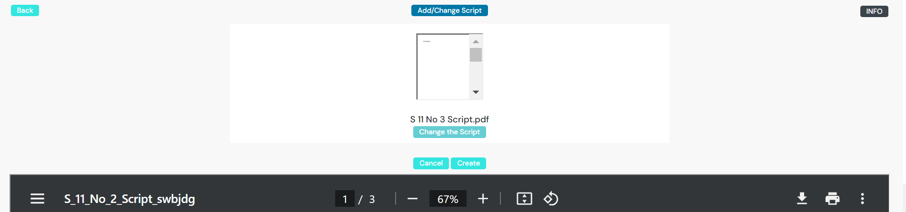
</h2>

 <strong>Success Message</strong>

<h2 align="center">
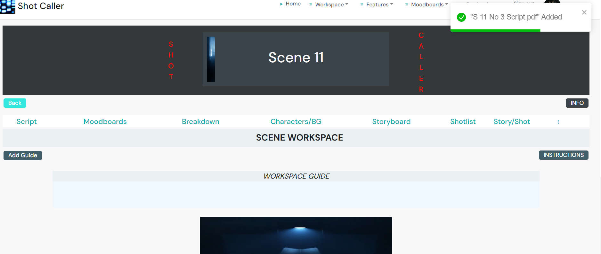
</h2>

 <strong>The "Script" page with the new Script "S 11 No 3 Script" - "Database" file name "S_11_No_3_Script_i8tapb"</strong>

<h2 align="center">
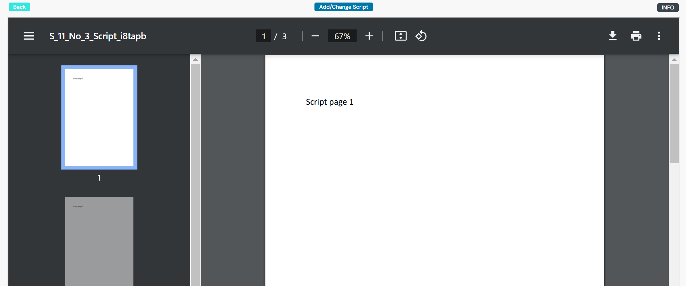
</h2>

#### Scene Storyboard
Description: View, Download, Print or Change the Scene Storyboard and View or Add the Storyboard URL 

- Use Case: View the Scene Storyboard 

  1. Click on Storyboard tab on the Scene page to open the Storyboard page in which the current Storyboard displays if one has been added.

 <strong>Scene Storyboard - "Portrait 6"</strong>

<h2 align="center">
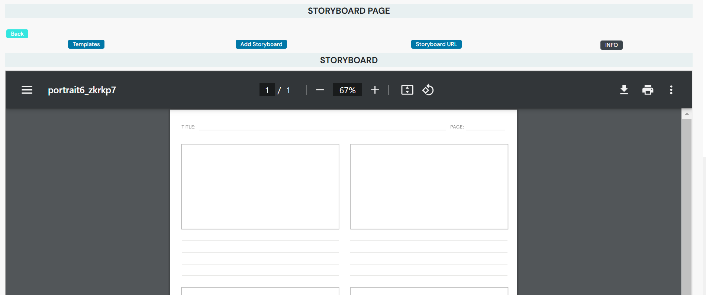
</h2>

- Use Case: Download the Scene Storyboard 

  1. Click on Download icon on the Storyboard page.
  2. The Storyboard is downloaded to the User's device.

- Use Case: Print the Scene Storyboard 

  1. Click on Print icon on the Storyboard page.
  2. The Storyboard is printed out on the User's printer.

- Use Case: Change the Scene Storyboard 

  1. Click on Storyboard tab on the Scene page to open the Storyboard page with the present Storyboard "Portrait6" displaying.
  2. Click on the "Add Storyboard" tab whether one has been added and is displaying or not.
  3. The Add/Change Storyboard form opens with the database name of the current Storyboard "portrait6_zkrkp7" displaying and a "Change Storyboard" tab underneath.  If no Storyboard has been added yet an "Upload Storyboard" message will display instead.
  4. Click "Change Storyboard" or "Upload Storyboard" to open the Desktop files.
  5. Select the desired file "Landscape6" and the desktop name of the selected file "Landscape6.pdf" displays in place of the previous one.
  6. Click Upload and the Storyboard is changed in the backend.
  7. A success message displays saying - "Storyboard Landscape6.pdf Added". 
  8. Click Storyboard tab to view the newly uploaded Storyboard "Landscape6" with the new database File name "landscape6_nqxnys" displaying above.

 <strong>The "Add/Change Storyboard" form displaying the current "Database" file name "portrait6_zkrkp7"</strong>

<h2 align="center">
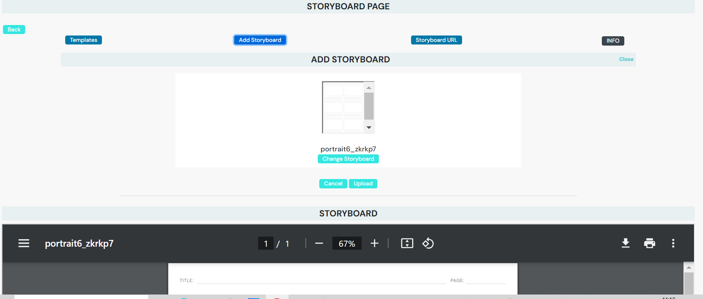
</h2>

 <strong>The "Add/Change Storyboard" form displaying the new "Desktop" file name "Landscape6.pdf"</strong>

<h2 align="center">
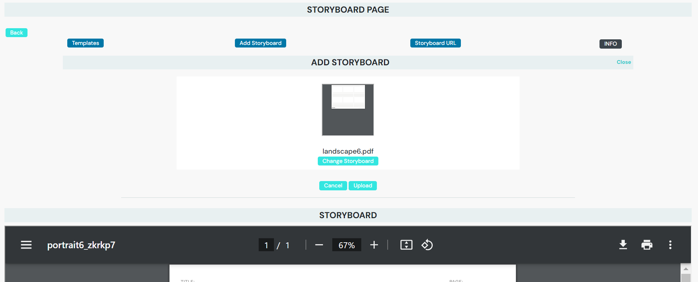
</h2>

 <strong>Success Message</strong>

<h2 align="center">
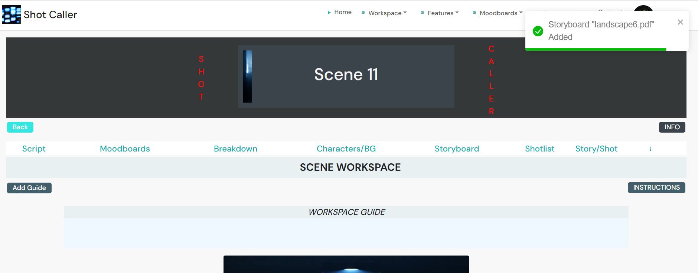
</h2>

 <strong>The "Storyboard" page with the new Storyboard "Landscape6" - "Database" file name "landscape6_nqxnys"</strong>

<h2 align="center">
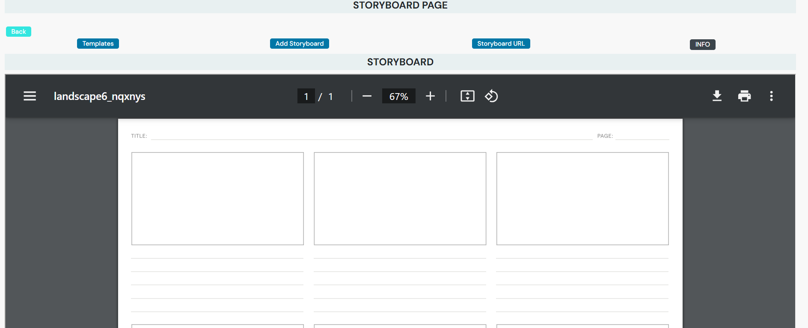
</h2>

- Use Case: View the Scene Storyboard Video 

  1. Click on Storyboard URL tab on the Storyboard page.
  2. The page opens with the video ready to play.

 <strong>Scene Storyboard Video</strong>

<h2 align="center">
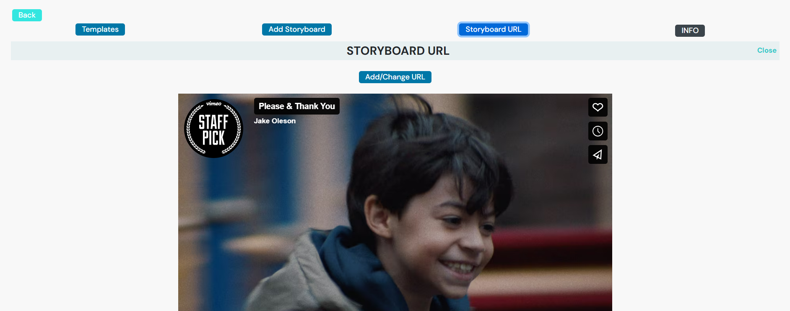
</h2>

- Use Case: Change the Scene Storyboard Video 

  1. Click on Storyboard URL tab on the Storyboard page.
  2. Click on the "Add/Change URL" tab.
  3. The Add/Change Storyboard URL form opens with the the current Storyboard URL displaying in the input box if one has been previously added.
  4. Enter the new Storyboard URL and submit.
  5. A success message displays saying - "Storyboard URL Added" and the Scene page is loaded. 
  8. Click Storyboard tab then the Storyboard URL tab to view the new video.

#### Scene Shotlist
Description: View and Add the Shotlist 

- Use Case: View the Scene Shotlist 

  1. Click on Shotlist tab on the Scene page to open the Shotlist page with the "Add Shot" tab on top and displaying all the currently added shots. 

 <strong>Shotlist Page</strong>

<h2 align="center">

</h2>

- Use Case: Add a Shot 

  1. Click on the "Add Shot" tab on the Shotlist page and the "Add Shot" form opens. 
  2. Input the fields, e.g. - Description - "Jack looks on" and add a sketch or image, e.g. "shotsketch" then submit.  
  3. A Success message displays and the Shot is added.
  4. Refresh the page and the Shot is ordered correctly and all the imputs display and the image "shotsketch" is added. 

 <strong>Add the Inputs</strong>

<h2 align="center">
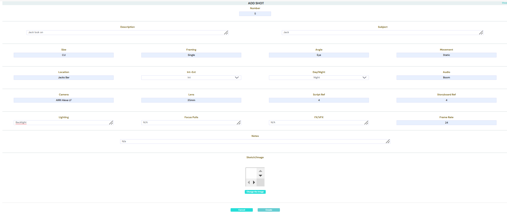
</h2>

 <strong>Success Message and Shot "6" is Added</strong>

<h2 align="center">
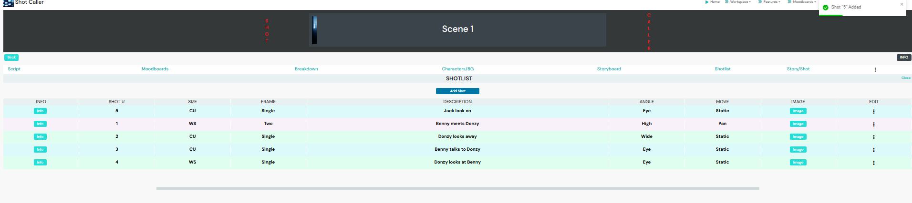
</h2>

- Use Case: View the Extra Info 

  1. Click on the "Info" tab and the "Extra Info" component opens with all the imputted info. 

 <strong>Extra Info</strong>

<h2 align="center">
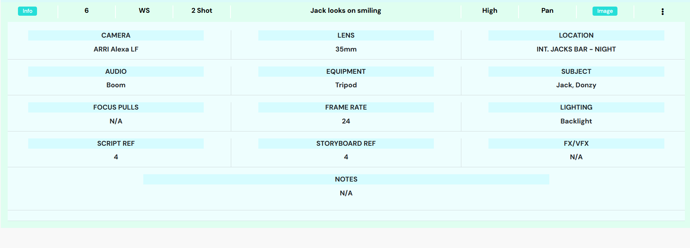
</h2>

- Use Case: View the Sketch/Image 

  1. Click on the "Image" tab and the "Image" component opens displaying the Image. 

 <strong>Image</strong>

<h2 align="center">
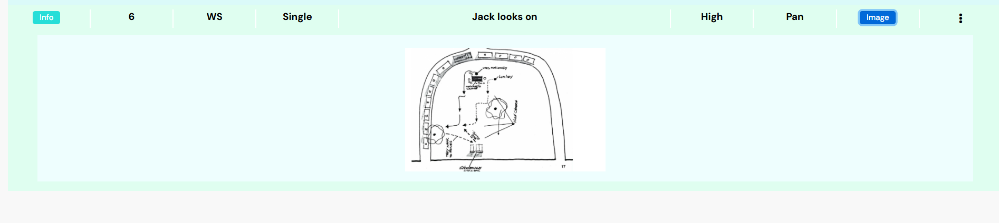
</h2>

- Use Case: View the Shot and Info in Mobile view 

  1. Click on the "Info" tab in Mobile view and the "Info" component opens displaying the Info. 

 <strong>Mobile view</strong>

<h2 align="center">
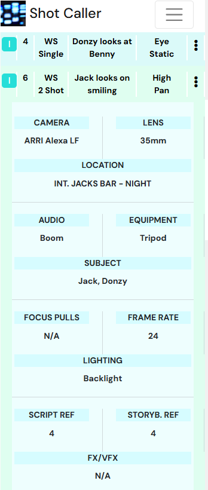
</h2>

- Use Case: Edit a Shot 

  1. Click on the "3 Dots Edit/Delete menu" tab and select Edit on the Shot and the "Edit Shot" form opens. 
  2. Input the new changes, e.g. - Description - "Jack looks on smiling" and add a new sketch or image then submit.  
  3. A Success message displays and the Shot is updated including the new image "shotsketch -2". 

 <strong>Add the Inputs</strong>

<h2 align="center">
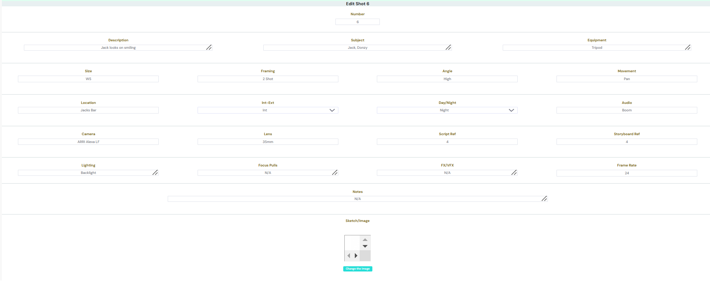
</h2>

 <strong>Success Message and Shot Updated</strong>

<h2 align="center">
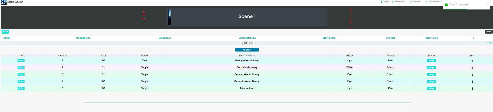
</h2>

- Use Case: Delete a Shot 

  1. Click on the "3 Dots Edit/Delete menu" tab on Shot "6" and select Delete.  
  2. A Modal opens asking to confirm Delete or Cancel.
  3. Click "Cancel" and the Shot is not deleted and the Edit/Delete menu disappears.  
  4. Click "Delete" and the Shot is deleted. 

 <strong>Modal</strong>

<h2 align="center">
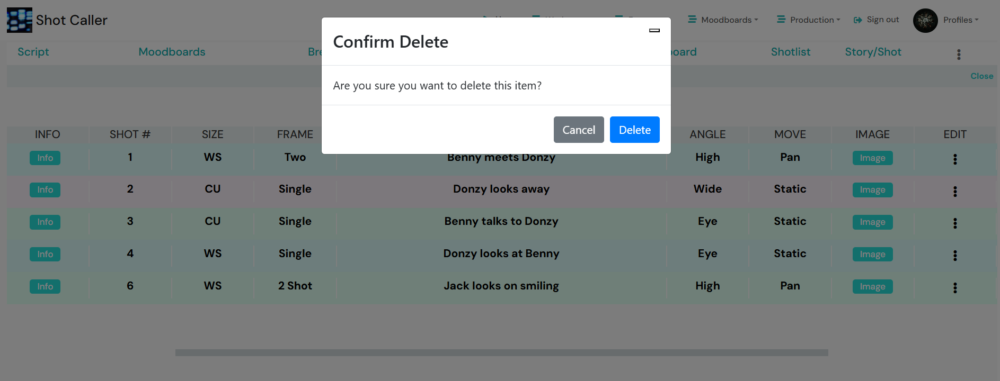
</h2>
#
 <strong>Shot "6" Deleted</strong>

<h2 align="center">
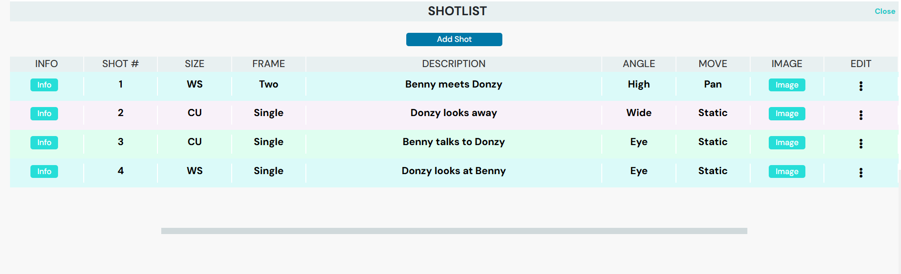
</h2>

#### Scenes Workspaces
Description: Collorate on Scenes by department through Posts with images 

- Use Case: View the Scenes Workspace 

  1. Click on the "Primary Scenes Worksace" tab on the Home page or in the Navbar to Open the page.
  2. Wiew the "Workspace Guide" on top and the departments below.

 <strong>nnnnnnnn</strong>

<h2 align="center">

</h2>

### Characters
Description: View and Create Characters. 

- Use Case: View all Characters 

  1. Click Characters on the Home page menu or from the Features navlink. 
  2. The Characters page opens with all the Characters displaying and the "Add Character" tab on top. 

 <strong>Sxxxx</strong>

<h2 align="center">

</h2>

- Use Case: Find a Characters in the Search Bar. 

  1. Input a Character name, e.g. "Benny" in the Search Bar. 
  2. All Characters with the word "Benny" are returned. 

 <strong>"Benny" Returned</strong>

<h2 align="center">

</h2>

- Use Case: Create a Character 

  1. Click the "Add Character" tab. 
  2. The "Create Character" form opens. 
  3. Input the Role, e.g. "Nic" then select the Character Number, e.g. "30" and submit. 
  4. A success message displays saying - "Character Nic Added". 
  5. The new Character Nic's page opens with Character Number - "30" and
  CallName - "cast30" which was automatically created.
  6. This CallName will be used by the admin when they register the User playing that Character and in turn it will be used to display their "Personal Call Time". 
  7. On going to the "Create Character" page the Number "30" will no longer be available.

 <strong>Create Form with Role "Nic" and Number "30" Selected</strong>

<h2 align="center">

</h2>

 <strong>Success Message and Nic's Page</strong>

<h2 align="center">
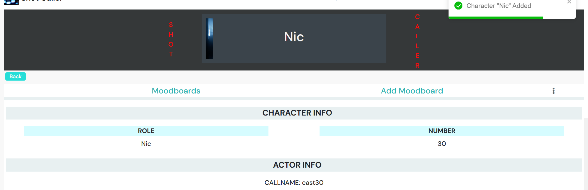
</h2>

 <strong>Number "30" is Unavailable Now</strong>

<h2 align="center">
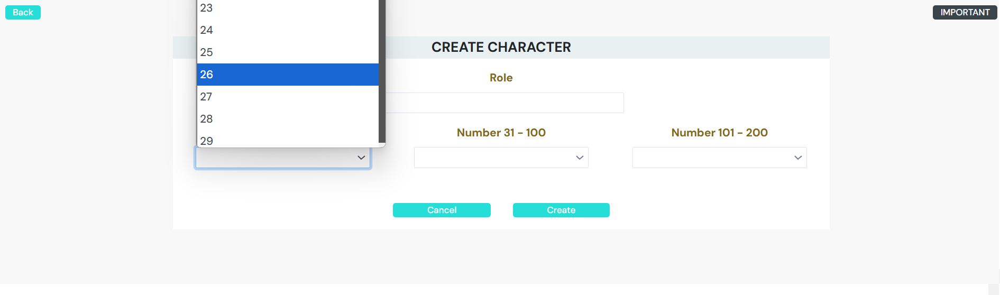
</h2>

- Use Case: Edit a Character from the Character Top on the Characters page 

  1. Click the "3 Dots Edit/Delete" icon and select Edit. 
  2. The "Edit Character" form opens. 

- Use Case: Delete a Character from the Character Top on the Characters page 

  1. Click the "3 Dots Edit/Delete" icon, e.g. Character "Nicky" and select Delete. 
  2. The "Cancel/Delete" Modal opens. 
  3. Click Cancel and the Modal closes.
  4. Click Delete and a Success message displays and the Character is deleted.

 <strong>Nicky Deleted</strong>

<h2 align="center">
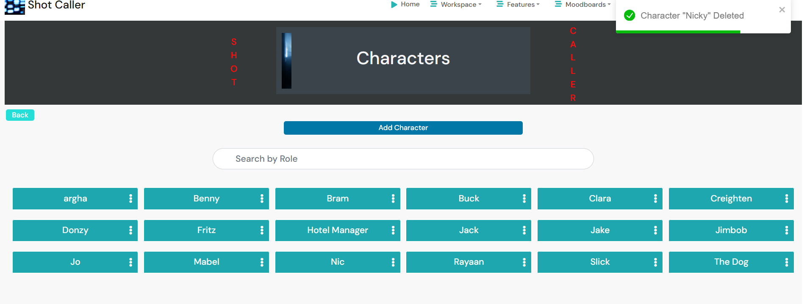
</h2>

- Use Case: Edit a Character from the Character page 

  1. Click the "3 Dots Edit/Delete" icon and select Edit. 
  2. The "Edit Character" form opens. 
  3. Enter the inputs including the 8 images and submit.  
  4. A succcess message displays and the inputs and images all display on the Character page.  

 <strong>Enter Inputs and Images</strong>

<h2 align="center">
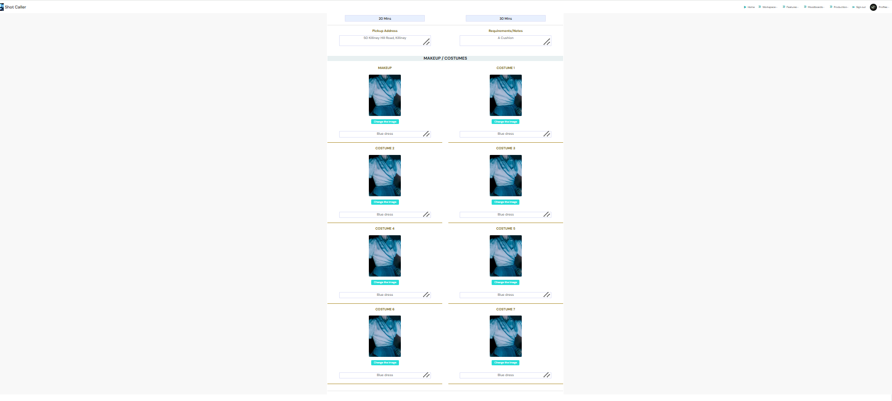
</h2>

 <strong>Inputs Display Correctly</strong>

<h2 align="center">
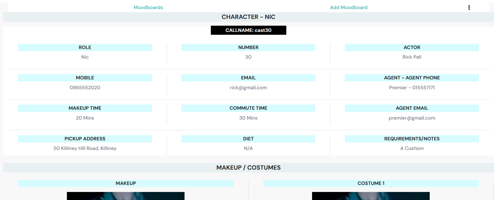
</h2>

 <strong>Images Display Correctly</strong>

<h2 align="center">
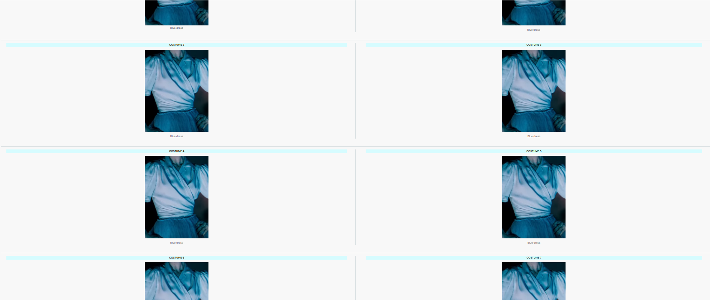
</h2>

- Use Case: Delete a Character from the Character page 

  1. Click the "3 Dots Edit/Delete" icon on the Character "Clara" - Number "111" page and select Delete. 
  2. The "Cancel/Delete" Modal opens. 
  3. Click Cancel and the Modal closes. 
  4. Click Delete and a Success message displays and the Character "Clara" is deleted. 
  5. Refresh the page and back on the Create Character page the Number "111" is now available again. 

  
 <strong>Number "111" is Unavailable</strong>

<h2 align="center">
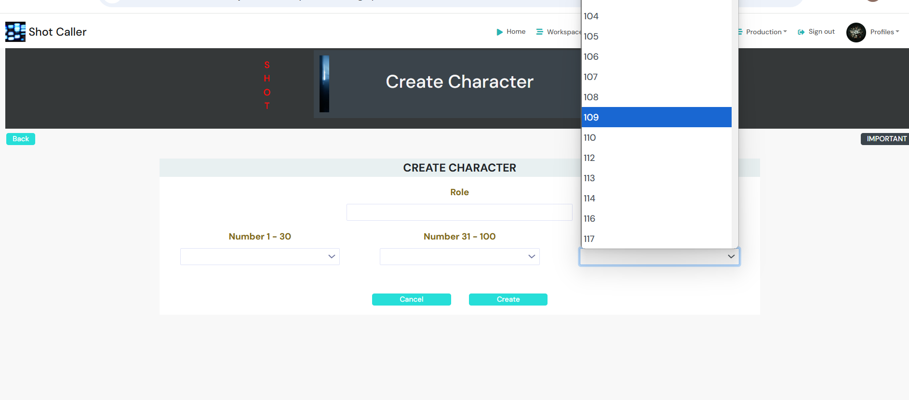
</h2>

 <strong>Number "111" is Available Now after Deleting Clara</strong>

<h2 align="center">
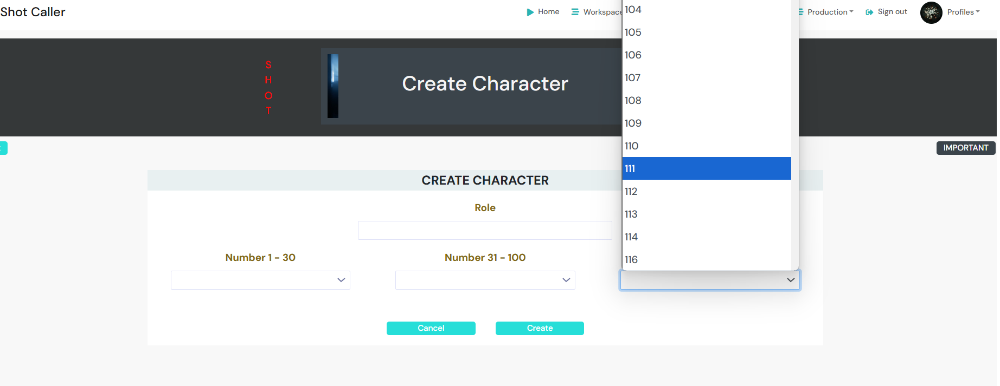
</h2>

### Locations
Description: View and Create Characters. 

- Use Case: View all Characters 

  1. Click . 
  2. Click . 

 <strong>Sxxxx</strong>

<h2 align="center">

</h2>

- Use Case: Find a xxx 

  1. Input a xxxx in the Search Bar, eg "bar". 
  2. All ccc with the word "xx" are returned. 

 <strong>"xxx" Posts Returned</strong>

<h2 align="center">

</h2>

- Use Case: Create a Character 

  1. Click the "Add xxx" tab. 
  2. The "Create xxx" form opens. 
  3. Input the details an xxxxs and submit. 
  4. A success message displays saying - "Post Added" 
  5. The new Post is added and is displayed with the Title, Content and all 5 images. 

 <strong>Create Form</strong>

<h2 align="center">
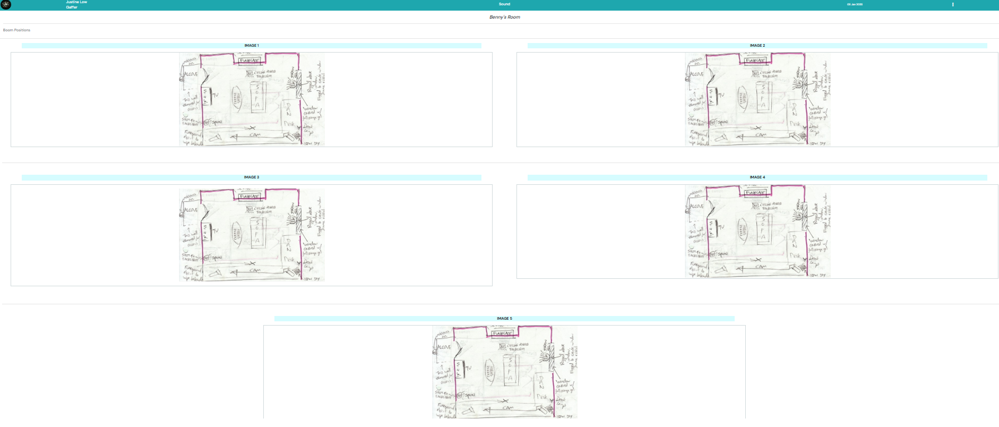
</h2>

 <strong>The xxx Displays</strong>

<h2 align="center">

</h2>

### Moodboards
Description: xxxx 

- Use Case: nnnn 

  1. nnnn.
  2. nnn.

 <strong>nnnnnnnn</strong>

<h2 align="center">

</h2>

### Index Cards 
Description: A series of Cards for each Scene containing Story and Style info 

- Use Case: View the Index Cards 

  1. Click Index Cards in the Home page menu. 
  2. The Index Cards page opens with the "Add Index Card" tab on top and all added Cards displaying in Rows on Large Screen and one after another on Mobile view. 

 <strong>Index Cards page</strong>

<h2 align="center">
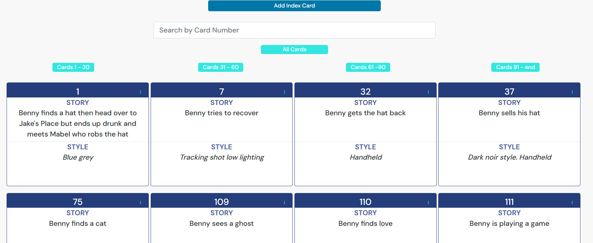
</h2>

- Use Case: Find an Index Card in the Search bar by it's number 

  1. Input a Card number in the Search Bar, eg 109. 
  2. Card 109 is returned. 

 <strong>Index Card 109</strong>

<h2 align="center">
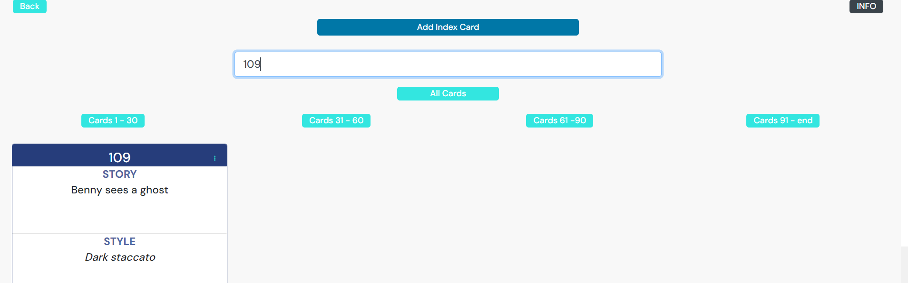
</h2>

- Use Case: View the Index Cards from 1 - 30 

  1. Click Cards 1 - 30 tab. 
  2. The Index Cards in this group are returned. 

 <strong>Index Cards page</strong>

<h2 align="center">
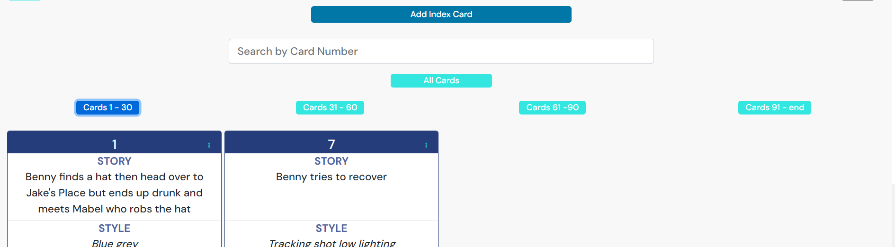
</h2>

- Use Case: View the Index Cards from 31 - 60 

  1. Click Cards 31 - 60 tab. 
  2. The Index Cards in this group are returned. 

 <strong>Index Cards page</strong>

<h2 align="center">
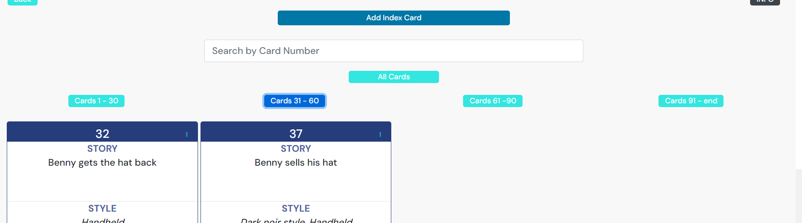
</h2>

- Use Case: View the Index Cards from 61 - 90 

  1. Click Cards 61 - 90 tab. 
  2. The Index Cards in this group are returned. 

 <strong>Index Cards page</strong>

<h2 align="center">
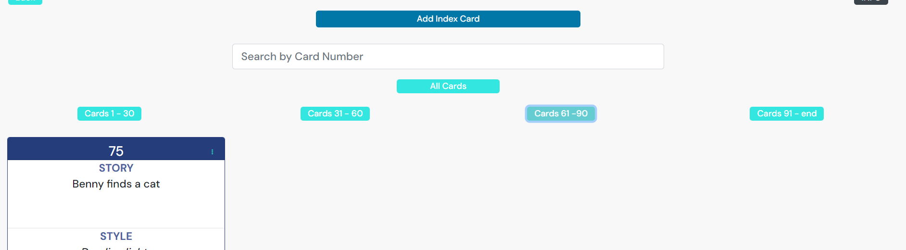
</h2>

- Use Case: View the Index Cards from 91 - end 

  1. Click Cards 91 - end tab. 
  2. The Index Cards in this group are returned. 

 <strong>Index Cards page</strong>

<h2 align="center">
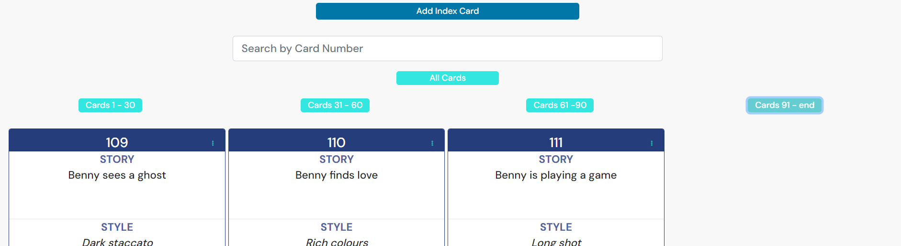
</h2>

- Use Case: Add an Index Card 

  1. Click the "Add Index Card" tab. 
  2. The "Create Index Card" form opens. 
  3. Input the Card Number, eg "8" along with the Story and Style fields and submit. 
  4. A success message displays saying - "Index Card "8" Added" 

 <strong>Create Index Card form</strong>

<h2 align="center">
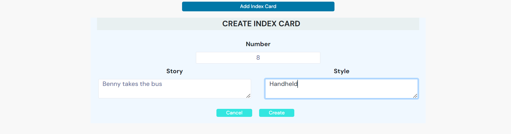
</h2>

 <strong>Success message</strong>

<h2 align="center">
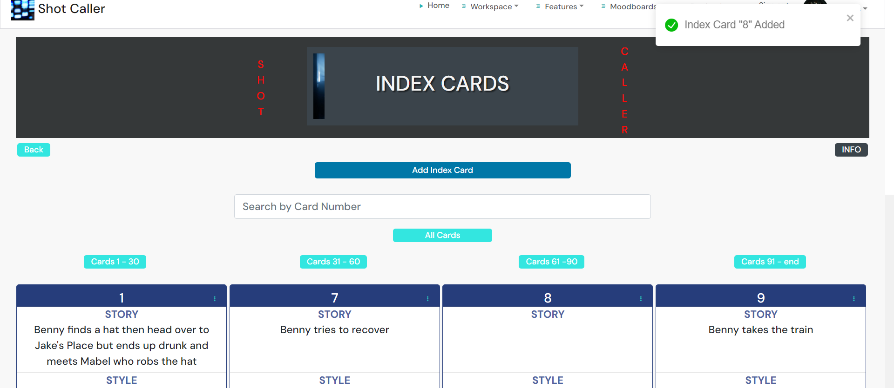
</h2>

 <strong>Index Card "8" Added"</strong>

<h2 align="center">

</h2>

- Use Case: Edit an Index Card 

  1. Click the 3 dots icon to open the Edit/Delete mini menu then click the Edit icon. 
  2. The "Edit Index Card" form opens. 
  3. Make changes and submit. 
   e.g. Number - "8" to "9", Story - "bus" to "train", Style - "Handheld" to "Steadicam". 
  4. A success message displays saying - "Index Card "8" Updated" 
  5. The Index Card now displays with the changes.

 <strong>Edit Index Card form</strong>

<h2 align="center">
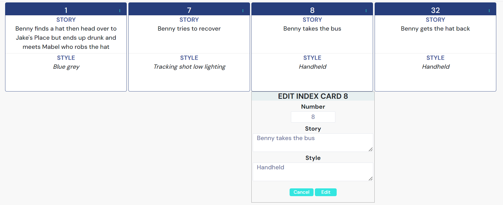
</h2>

 <strong>Edit Form</strong>

<h2 align="center">
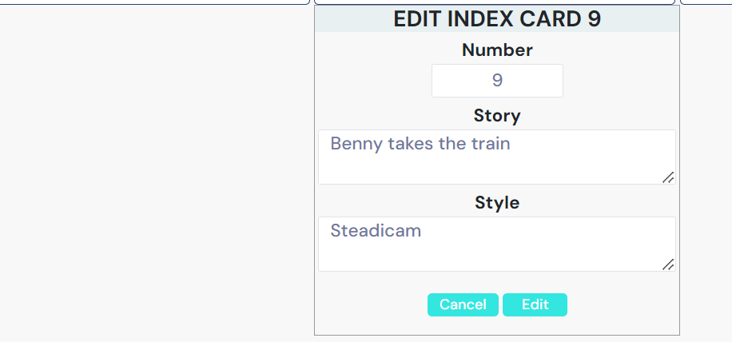
</h2>

 <strong>Index Card with Changes</strong>

<h2 align="center">
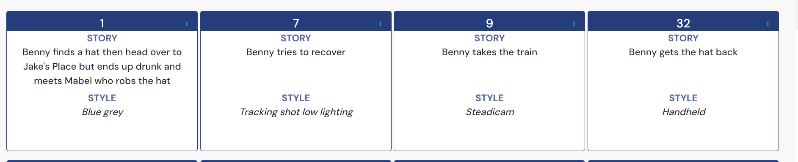
</h2>

### Index Shots 
Description: Create any number of Series each containing a display of succesive images relating to a particular theme. 

- Use Case: View the Index Shot Series 

  1. Click Index Shots in the Home page menu. 
  2. The Index Shots page opens with the "Create Series" tab on top and all created Series displaying in Rows. 

 <strong>Index Shots page</strong>

<h2 align="center">
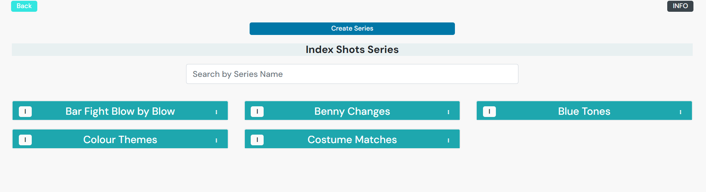
</h2>

- Use Case: Find a Series in the Search bar by it's name 

  1. Input a name in the Search Bar, eg costumes. 
  2. All series with word costumes are returned, e.g. "Costume Matches". 

 <strong>Series "Costume Matches"</strong>

<h2 align="center">

</h2>

- Use Case: View a Series description 

  1. Click on the "I" icon. 
  2. The description of the Series's Content displays. 

 <strong>Series "Costume Matches"</strong>

<h2 align="center">
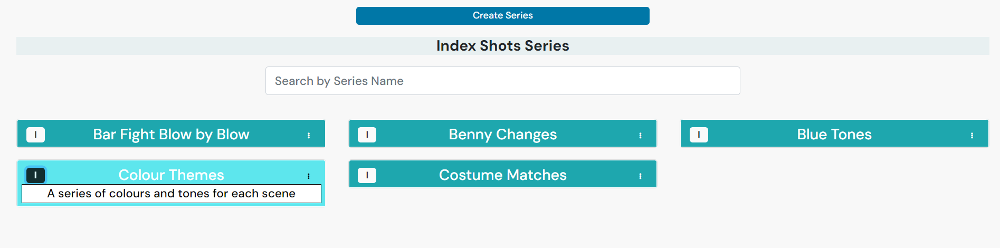
</h2>

- Use Case: Create a Series 

  1. Click the "Create Series" tab. 
  2. The "Create Series" form opens. 
  3. Input the Name, e.g. "Angles Scene 1" and Content fields and submit. 
  4. A success message displays saying - "Series "Angles Scene 1" Added" 
  5. The new Series "Angles Scene 1" is added. 

 <strong>Create Index Shot Series form</strong>

<h2 align="center">

</h2>

 <strong>Success Message</strong>

<h2 align="center">
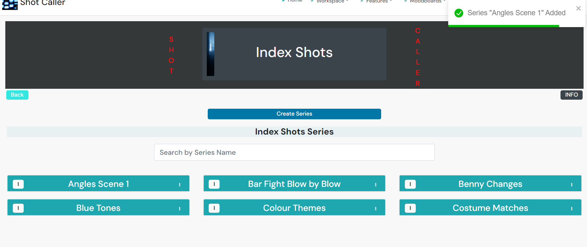
</h2>

 <strong>Series "Angles Scene 1" Added</strong>

<h2 align="center">
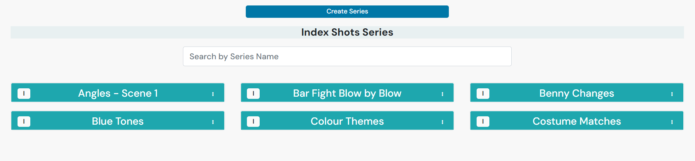
</h2>

- Use Case: Edit a Series 

  1. Click the "3 Dots on the Series" tab. 
  2. The "Edit Series" form opens. 
  3. Input new Name, e.g. "Angles Scene 2" and Content fields and submit. 
  4. A success message displays saying - "Series "Angles Scene 1" Updated" 
  5. The Series is updated. 

 <strong>Edit Series form</strong>

<h2 align="center">

</h2>

 <strong>Make Changes</strong>

<h2 align="center">
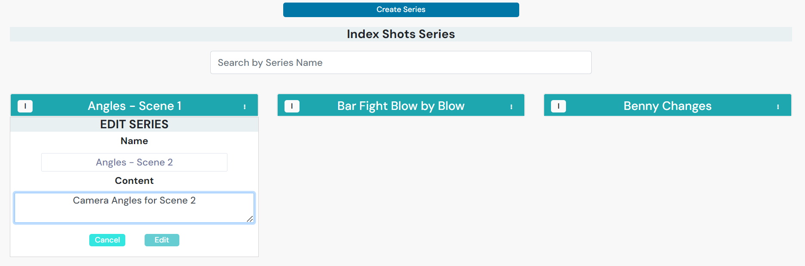
</h2>

 <strong>Success Message</strong>

<h2 align="center">
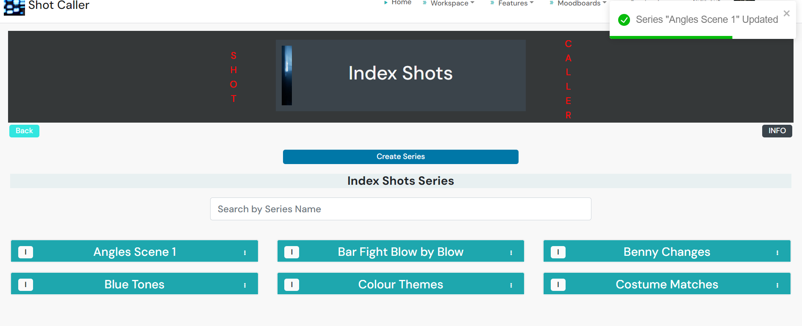
</h2>

 <strong>Changes display</strong>

<h2 align="center">
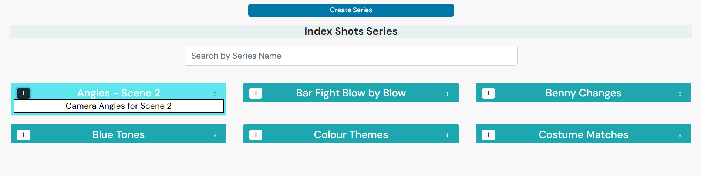
</h2>

- Use Case: Delete a Series 

  1. Click the "3 Dots on the Series" tab and click the delete icon. 
  2. A dropdown opens asking to confirm delete. 
  3. Select Yes and the Series is deleted 
  4. The Series is updated. 

 <strong>Click the delete icon</strong>

<h2 align="center">
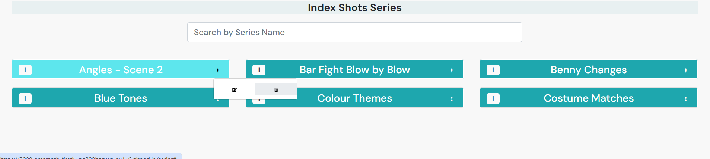
</h2>

 <strong>The Confirm dropdown</strong>

<h2 align="center">
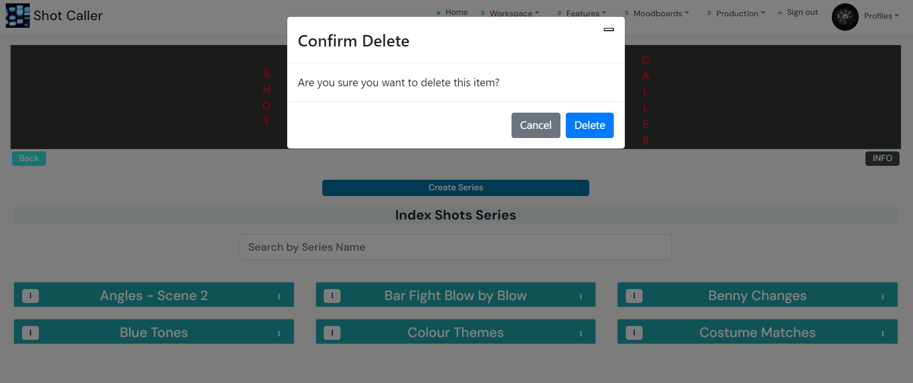
</h2>

 <strong>Series Deleted</strong>

<h2 align="center">
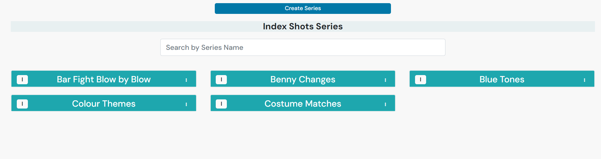
</h2>

- Use Case: View a Series's Index Shots 

  1. Click on a Series. 
  2. The Index Shots for that Series display in Rows in Desktop. 
  2. The Index Shots for that Series display in a Column in Mobile. 

 <strong>Index Shots Desktop view</strong>

<h2 align="center">

</h2>

 <strong>Index Shots Mobile View</strong>

<h2 align="center">

</h2>

- Use Case: Find an Index Shot in the Search bar by it's number,e.g "1" 

  1. Input a Shot number in the Search Bar, eg 1. 
  2. Shot 1 is returned. 

 <strong>Index Shot 1</strong>

<h2 align="center">
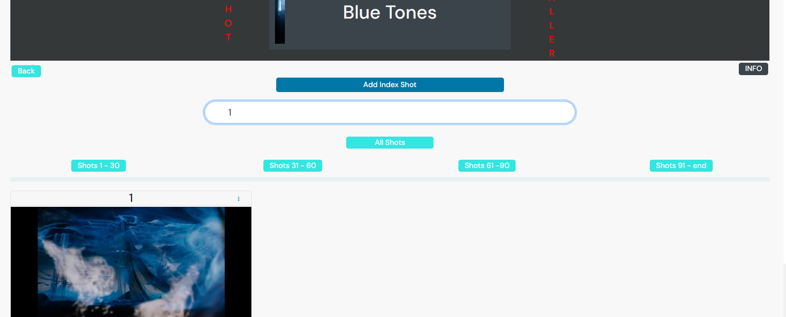
</h2>

- Use Case: View the Index Shots from 1 - 30 

  1. Click Shots 1 - 30 tab. 
  2. The Index Shots in this group are returned. 

- Use Case: View the Index Shots from 31 - 60 

  1. Click Shots 31 - 60 tab. 
  2. The Index Shots in this group are returned. 

- Use Case: View the Index Shots from 61 - 90 

  1. Click Shots 61 - 90 tab. 
  2. The Index Shots in this group are returned. 

- Use Case: View the Index Shots from 91 - end 

  1. Click Shots 91 - end tab. 
  2. The Index Shots in this group are returned. 

 <strong>Index Shot 99</strong>

<h2 align="center">
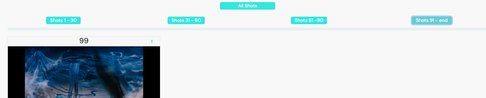
</h2>

- Use Case: Add an Index Shot 

  1. Click the "Add Index Shot" tab. 
  2. The "Create Index Shot" form opens. 
  3. Input the Shot Number, eg "99" along with the Content and submit. 
  4. A success message displays saying - "Index Shot "99" Added" 

 <strong>Create Index Card form</strong>

<h2 align="center">
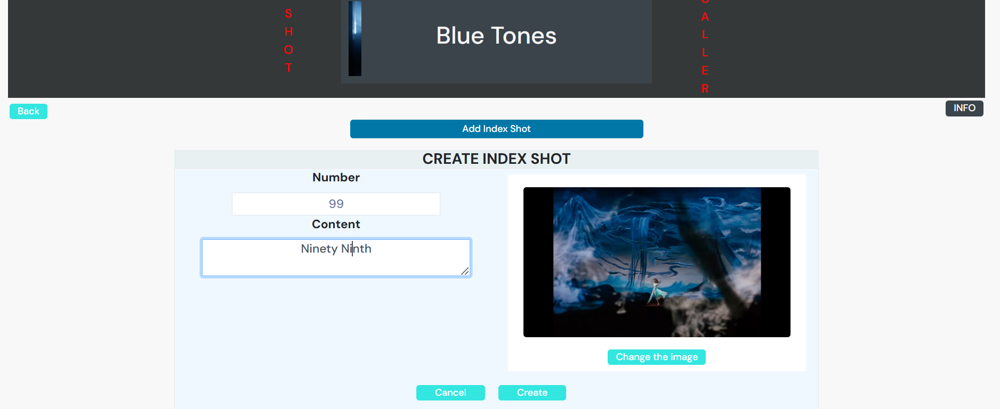
</h2>

 <strong>Success message</strong>

<h2 align="center">
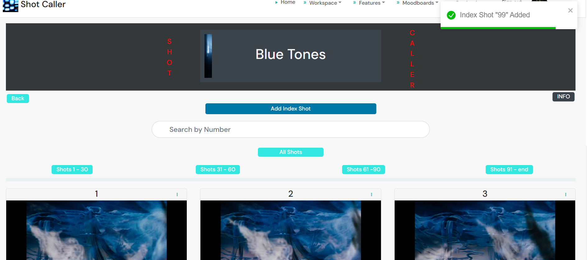
</h2>

- Use Case: Edit an Index Shot 

  1. Click the 3 dots icon to open the Edit/Delete mini menu then click the Edit icon. 
  2. The "Edit Index Shot" form opens. 
  3. Make changes and submit. 
   e.g. Number - "99" to "4" and change the image 
  4. A success message displays saying - "Index Shot "4" Updated" 
  5. The Index Shot now displays with the changes and it's new number,.

 <strong>Edit Index Shot form</strong>

<h2 align="center">
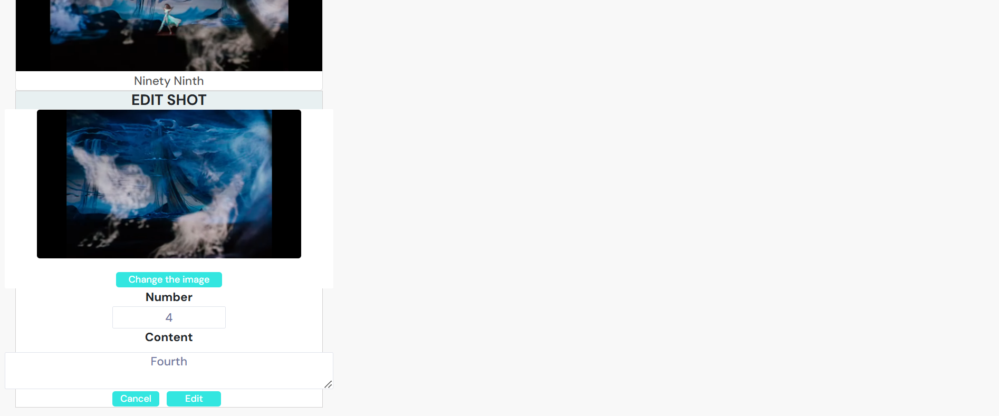
</h2>

 <strong>Index Card with Changes and success Message</strong>

<h2 align="center">
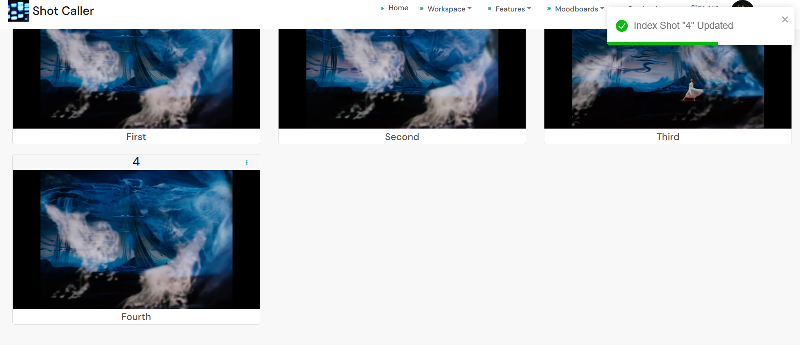
</h2>

### Departments
Description: View and Create Post within each Department outside and separate to the posts in the scene workspace. 

- Use Case: View a Department's Posts 

  1. Click Depts-Xtra in the Home page menu to open the Department page. 
  2. Click on a Department, e.g. "Sound" and that Department's Posts page opens with the "Add Post" tab on top and the Posts displaying below. 

 <strong>Sound Dept Posts page</strong>

<h2 align="center">
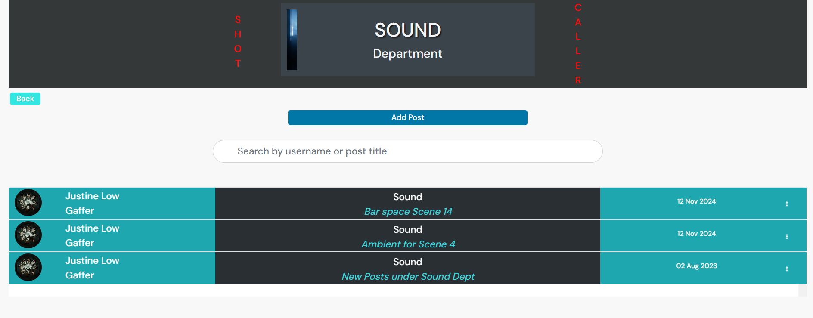
</h2>

- Use Case: Find a Post in the Search bar by it's title or the owner's name 

  1. Input a title in the Search Bar, eg "bar". 
  2. All Posts with the word "bar" are returned. 

 <strong>"Bar" Posts Returned</strong>

<h2 align="center">
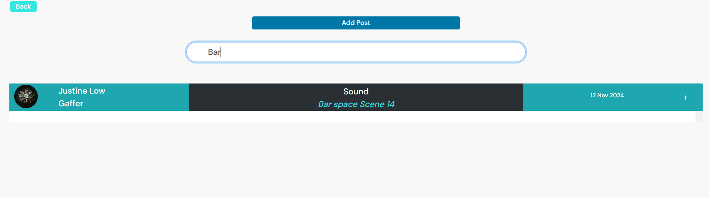
</h2>

- Use Case: Create a Post 

  1. Click the "Add Post" tab. 
  2. The "Create Post" form opens. 
  3. Input the details an upload up to 5 Images and submit. 
  4. A success message displays saying - "Post Added" 
  5. The new Post is added and is displayed with the Title, Content and all 5 images. 

 <strong>Create Form</strong>

<h2 align="center">

</h2>

 <strong>The New Post Displays</strong>

<h2 align="center">
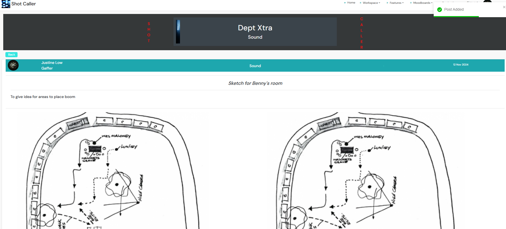
</h2>

- Use Case: Open an Unopend Post to view its details and change its background and text colours to indicate it has been opened. 

  1. Click on an unopened Post, with background Black and text White and Blue. 
  2. The Post opens. 
  3. Returning to the Posts page the background is now White and the text Blue. 

 <strong>Opened Post</strong>

<h2 align="center">
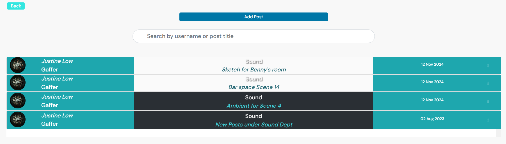
</h2>

- Use Case: Edit a Post 

  1. Click on the "Edit/Delete" icon. 
  2. The "Edit Post" form opens. 
  3. Input the changes including the 5 Images and submit. 
  4. A success message displays saying - "Post Edited" 
  5. The new Post displays with the changes and all new 5 images. 

 <strong>Edit Form</strong>

<h2 align="center">

</h2>

 <strong>The Edited Post</strong>

<h2 align="center">

</h2>

### Character and locations page
Description: xxxx 

- Use Case: nnnn 

  1. nnnn.
  2. nnn.

 <strong>nnnnnnnn</strong>

<h2 align="center">

</h2>

## General Features

### User Login/Logout
Description: A User can easily Log In and out  

- User Case: User Log In  
  
  Action: The User can Login by entering ther Username and Password. 
  Result: The User is logged in and their Profile image displays in their My Account link in the Navbar if they have uploaded one. 

- User Case: User Log Out  

  Action: The User can Logout by clicking the Log Out tab in the navbar. 
  Result: The User is logged out and they are taken to the Sign In page. 

### User Change/Recover Password
Description: The User can change or recover their Password. 

- User Case: Change Password  

  Action: The User can change their Password by clicking on the three dots on their Profile page and entering a new password. 
  Result: The User receives an email advising them of their new Password. 

- User Case: Forget Password  

  Action: The User can recover their Password if forgotten by clicking on the "Forgot Password" link on the Sign In page then entering their email and a new password. 
  Result: The User receives an email advising them of their new Password. 

### Security by both Frontend and Backend checks
Description: Security measures by both Frontend and Backend code checks prevent unauthorised users from accessing Project URLs they don't are not registered on. 

- Use Case: Unregistered User on any Project enters a Project URL. 

  1. The User, unregistered on any Project in the app, enters a URL for a Project
  2. Result: A 401 displays for the User? 

 <strong>nnnnnnnn</strong>

<h2 align="center">

</h2>

- Uses Case: User registered on one Project enters URL for a different one 

   1. The User enters a URL for a Project they are not registered on despite being 
      registered on another Project in the app. 
  2. A 401 displays for the User.?

### Responsive Design
Description: The site is responsive to all screen sizes and the images respond in proportion.  

- Use Case: xxx 
