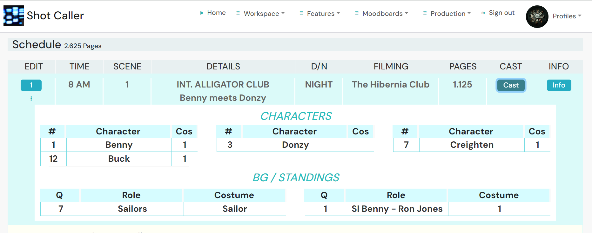
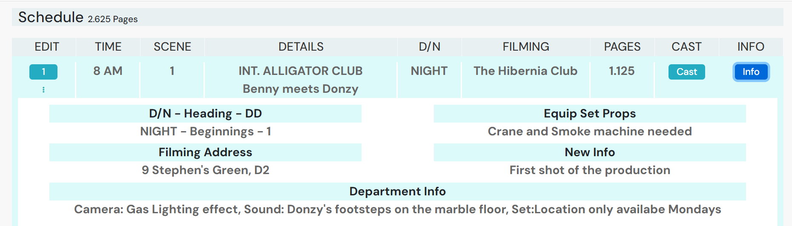

## Features - Usage and Testing

 <strong>xxx</strong>

<h2 align="center">

</h2>

## Features

## The Production Features

### User Management and Registration
Description: The admin and superadmin can register new Users and change their Permissions at any time. 

- User Case: Register Users 

  Action: Access User Registration from the Crew/Cast Management tab to find a Permissions select menu. 
  Result: Registration page opens with the select menu on display. 

  Action: Register the User by selecting a Permission and enter a Username and Password for the User. 
  Result: The User receives an email with the Project URL along with their Username and Password. 

 <strong>xxxxxxxxxxxxxxx</strong>

<h2 align="center">

</h2>

 <strong>xxxxxxxxxxxxxxxxxxxx</strong>

<h2 align="center">

</h2>

- User Case: Change a User's Permission 

  Action: Change the User's Permission by selecting a new Permission for the User. 
  Result: The User receives an email advising them of their new Permission. 

 <strong>xxxxxxxxxxxxxxxxx</strong>

<h2 align="center">

</h2>

 <strong>xxxxxxxxxxxxxxxx</strong>

<h2 align="center">

</h2>

### Scheduling
Description/Requirements: View Schedules for a Shoot Day. Create Schedules by Creating Days then selecting Scenes from a menu which automatically adds the Scene's breakdown info to a stripboard. 

- User Case: View all Shoot Days. 

  1. Click on the Schedules link in the Home page or from the Navbar. 
  2. The Schedules page displays with all the Shoot days. 

 <strong>xxxxxxxxxxxxxxx</strong>

<h2 align="center">

</h2>

 <strong>xxxxxxxxxxxxxx</strong>

<h2 align="center">

</h2>

- User Case: Create a Shoot Day. 

  1. On the Schedules page click on the "Create Day" tab. 
  2. The Create Day form displays.  
  3. Select the date from the calender. 
  4. The date is added. 
  5. Add the day value. 
  6. Press submit. 
  7. The Day is created and added to the page. 

 <strong>xxxxxxxxxxxxxxx</strong>

<h2 align="center">

</h2>

 <strong>xxxxxxxxxxxxxxxxxxxxx</strong>

<h2 align="center">

</h2>

- User Case: Find a Shoot Day in the Calender. 

  1. Click on the desired date in the calender. 
  2. The Shoot Day opens if one has been created for that date.  

 <strong>xxxxxxxxxxx</strong>

<h2 align="center">

</h2>

 <strong>xxxxxxxxxxxxxxxxxx</strong>

<h2 align="center">

</h2>

- User Case: Find a Shoot Day from the Search Bar. 

  1. Enter the Day Number in the Search Bar and Submit. 
  2. The Shoot Day opens if one has been created for that Number.  

 <strong>xxxxxxxxxxxxxxxxx</strong>

<h2 align="center">

</h2>

 <strong>xxxxxxxxxxxxxxxxx</strong>

<h2 align="center">

</h2>

- User Case: View the Shoot Day and its Stripboard. 

  1. Click on the Shoot Day from the the selection displaying on the page or from the one if returned from the Calender search or Search Bar. 
  2. The Shoot Day opens and the Add Scenes tab and Stripboard displays.  

 <strong>xxxxxxxxxxxxxxxxxxxxx</strong>

<h2 align="center">

</h2>

 <strong>xxxxxxxxxxxxxxxxxxxxxx</strong>

<h2 align="center">

</h2>

- User Case: Add Schedule Scenes to a Shoot Day. 

  1. Click on the Shoot Day. 
  2. The Shoot Day opens with the Add Scenes tab and Stripboard.  
  3. Click the the Add Scene tab. 
  4. The Add Scene form opens below. 
  5. Click on the Act One tab and the Scenes from Act One display. 
  6. Click on the Act Two A tab and the Scenes from Act Two A display. 
  7. Click on the Act Two B tab and the Scenes from Act Two B display. 
  8. Click on the Act Three tab and the Scenes from Act Three display. 
  9. Click on the Location tab and the Scenes display by Location. 
  10. Input a Scene number, Title or Location to the Search Bar then click one of the above tabs and the Scenes in that tab group with the search value display. 
  11. Select a Scene by clicking on it and the Shooting Info form opens below with the Scene numberon top. 
  12. Input the Day Order Number and other values and press Add Scene. It is up to the User to input an unused Number or there will be more that one Day Order munber with the smae number. 
  13. The Schedule Scene is added to the Stripboard and the page count is updated by Scene 4's length of 1 to 3.75. 

 <strong>Add Scene Form</strong>

<h2 align="center">

</h2>

 <strong>Act One Scenes displaying after clicking the Act One tab</strong>

<h2 align="center">

</h2>

 <strong>Enter value "Jake" in Search bar</strong>

<h2 align="center">

</h2>

 <strong>Act One Scenes with Location Jake display</strong>

<h2 align="center">

</h2>

 <strong>Enter Shooting Info with Day order Number "6" and submit form</strong>

<h2 align="center">

</h2>

 <strong>Scene 4 is added to the Stripboard with Day order number "6"</strong>

<h2 align="center">

</h2>

- User Case: Edit Schedule Scene. 

  1. Click on the three Dots edit icon to open the Edit/Delete mini menu and click Edit. 
  2. The Edit page opens with the fetched Schedule Scene info in the input boxes 
  3. Make changes and click Edit. 
  4. The Stripboard opens with the changes to that Schedule Scene. 

 <strong>Make changes to New Info field</strong>

<h2 align="center">

</h2>

 <strong>Stripboard after submitting</strong>

<h2 align="center">

</h2>

- User Case: Add a Next row with move or break info below a Schedule Scene. 

  1. Click on the three Dots edit icon to open the Edit/Delete mini menu and click Edit. 
  2. The Edit page opens with the fetched Schedule Scene info in the input boxes 
  3. Input the new Next info in the Next input box and click Edit. 
  4. The Stripboard opens with the new next Row displaying below that Schedule Scene. 

 <strong>Make changes to Next field</strong>

<h2 align="center">

</h2>

 <strong>Stripboard after submitting</strong>

<h2 align="center">

</h2>

- User Case: Re-Order a Schedule Scene. 

  1. Click on the Re-Order button which currently displays the Scene's current order and the re-order form opens. 
  2. Input the new Order number and click Create. 
  3. The Stripboard opens with the new Order number for the Schedule Scene. 
  4. Re-order all the following Schedule Scenes in a similar manner. 

 <strong>Make changes to Re-Order field</strong>

<h2 align="center">

</h2>

 <strong>Stripboard after submitting</strong>

<h2 align="center">

</h2>

- User Case: Add a Next row with new info below a Schedule Scene from the Re-Order form. 

  1. Click on the Re-Order button and the re-order form opens. 
  2. Input the new Next info in the Next input box and click Create. 
  3. The Stripboard opens with the new next Row displaying below that Schedule Scene. 

 <strong>Make changes to Next field</strong>

<h2 align="center">

</h2>

 <strong>Stripboard after submitting</strong>

<h2 align="center">

</h2>

- User Case: View the Schedule Scene Characters. 

  1. Click on the Cast button. 
  2. The Cast Info displays below. 

 <strong>Character Info</strong>

<h2 align="center">

</h2>

- User Case: View the Schedule Scene Info. 

  1. Click on the Info button. 
  2. The Info displays below. 

 <strong>Scene Info</strong>

<h2 align="center">

</h2>

### Callsheets
Description: xxxx 

- User Case: xxx 

  Action: xxx. 
  Result: vvv 

  Action: xxx 
  Result: The User  

### Budgeting 
- As this feature is held on the "Shot Caller Production" home app the Budgeting testing is on it's Testing page. [Testing](https://github.com/johnston9/shot-caller-production/blob/main/TESTING.md) 

## The Creative Features
Description: xxxx 

- User Case: xxx 

  Action: xxx. 
  Result: vvv 

  Action: xxx 
  Result: The User  

### Scenes Breakdown
Description: xxxx 

- User Case: xxx 

  Action: xxx. 
  Result: vvv 

  Action: xxx 
  Result: The User  

### Scenes Workspaces
Description: xxxx 

- User Case: xxx 

  Action: xxx. 
  Result: vvv 

  Action: xxx 
  Result: The User  

### Scenes Shotlists
Description: xxxx 

- User Case: xxx 

  Action: xxx. 
  Result: vvv 

  Action: xxx 
  Result: The User  

### Scenes Costumes
Description: xxxx 

- User Case: xxx 

  Action: xxx. 
  Result: vvv 

  Action: xxx 
  Result: The User  

### Scenes Script
Description: xxxx 

- User Case: xxx 

  Action: xxx. 
  Result: vvv 

  Action: xxx 
  Result: The User  

### Scenes Storyboard
Description: xxxx 

- User Case: xxx 

  Action: xxx. 
  Result: vvv 

  Action: xxx 
  Result: The User  

### Character and locations pages
Description: xxxx 

- User Case: xxx 

  Action: xxx. 
  Result: vvv 

  Action: xxx 
  Result: The User  

### Moodboards
Description: xxxx 

- User Case: xxx 

  Action: xxx. 
  Result: vvv 

  Action: xxx 
  Result: The User  

### Index Cards 
Description: xxxx 

- User Case: xxx 

  Action: xxx. 
  Result: vvv 

  Action: xxx 
  Result: The User  

### Index Shots 
Description: xxxx 

- User Case: xxx 

  Action: xxx. 
  Result: vvv 

  Action: xxx 
  Result: The User  

### Departments
Description: xxxx 

- User Case: xxx 

  Action: xxx. 
  Result: vvv 

  Action: xxx 
  Result: The User  

## General Features

### User Login/Logout
Description: A User can easily Log In and out  

- User Case: User Log In  
  
  Action: The User can Login by entering ther Username and Password. 
  Result: The User is logged in and their Profile image displays in their My Account link in the Navbar if they have uploaded one. 

- User Case: User Log Out  

  Action: The User can Logout by clicking the Log Out tab in the navbar. 
  Result: The User is logged out and they are taken to the Sign In page. 

### User Change/Recover Password
Description: The User can change or recover their Password. 

- User Case: Change Password  

  Action: The User can change their Password by clicking on the three dots on their Profile page and entering a new password. 
  Result: The User receives an email advising them of their new Password. 

- User Case: Forget Password  

  Action: The User can recover their Password if forgotten by clicking on the "Forgot Password" link on the Sign In page then entering their email and a new password. 
  Result: The User receives an email advising them of their new Password. 

### Security by both Frontend and Backend checks
Description: Security measures by both Frontend and Backend code checks prevent unauthorised users from accessing Project URLs they don't are not registered on. 

- User Case: Unregistered User on any Project enters a Project URL 

  Action: The User, unregistered on any Project in the app, enters a URL for a Project  
  Result: A 401 displays for the User. 

- User Case: User registered on one Project enters URL for a different one 

- The User enters a URL for a Project they are not registered on despite being registered on another Project in the app. 
  Result: A 401 displays for the User.

### Responsive Design
Description: The site is responsive to all screen sizes and the images respond in proportion.  

- User Case: xxx 

  Action: xxx. 
  Result: vvv 

  Action: xxx 
  Result: The User  