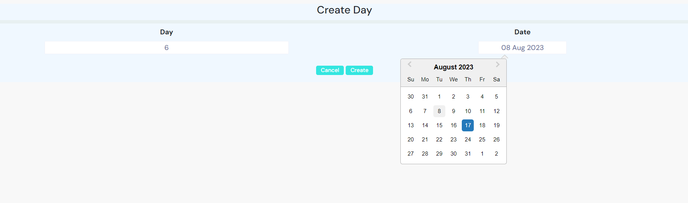
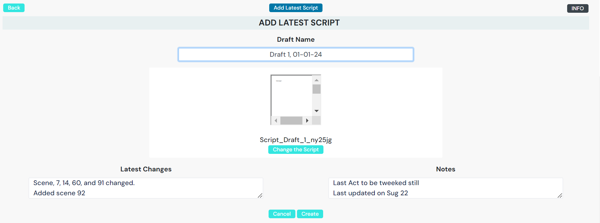
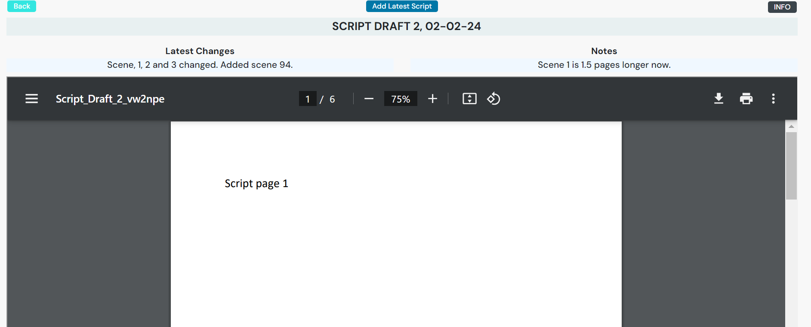

## Features - Usage and Testing

 <strong>xxx</strong>

<h2 align="center">

</h2>

## Features

## The Production Features

### User Management and Registration
Description: The admin and superadmin can register new Users and change their Permissions at any time. 

- User Case: Register Users 

  Action: Access User Registration from the Crew/Cast Management tab to find a Permissions select menu. 
  Result: Registration page opens with the select menu on display. 

  Action: Register the User by selecting a Permission and enter a Username and Password for the User. 
  Result: The User receives an email with the Project URL along with their Username and Password. 

 <strong>xxxxxxxxxxxxxxx</strong>

<h2 align="center">

</h2>

 <strong>xxxxxxxxxxxxxxxxxxxx</strong>

<h2 align="center">

</h2>

- User Case: Change a User's Permission 

  Action: Change the User's Permission by selecting a new Permission for the User. 
  Result: The User receives an email advising them of their new Permission. 

 <strong>xxxxxxxxxxxxxxxxx</strong>

<h2 align="center">

</h2>

 <strong>xxxxxxxxxxxxxxxx</strong>

<h2 align="center">

</h2>

### Scheduling
Description: View Schedules for a Shoot Day. Create Schedules by Creating Days then selecting Scenes from a menu which automatically adds the Scene's breakdown info to a stripboard. 

- Use Case: View all Shoot Days. 

  1. Click on the Schedule link in the Home page or from the Navbar. 
  2. The Schedule page displays with all the Shoot Days. 

 <strong>The Schedule page</strong>

<h2 align="center">

</h2>

- Use Case: Create a Shoot Day. 

  1. On the Schedule page click on the "Create Day" tab. 
  2. The Create Day form displays.  
  3. Select the Date from the input box Calender - "08 Aug 2023". 
  4. The Date is added. 
  5. Add the Day number - "6". 
  6. Press submit. 
  7. The Shoot Day number "6" and Date "08 Aug 2023" is created and added to the page. 

 <strong>Day number "6" and Date "08 Aug 2023" added to form</strong>

<h2 align="center">

</h2>

 <strong>Shoot Day: Number "6"and Date "08 Aug 2023" Created</strong>

<h2 align="center">

</h2>

- Use Case: Find a Shoot Day in the Calender. 

  1. Click on the desired date in the Calender - "02 Jan 2023". 
  2. The Shoot Day opens if one has been created for that date.  

 <strong>Shoot Day "02 Jan 2023"</strong>

<h2 align="center">

</h2>

- Use Case: Find a Shoot Day from the Search Bar. 

  1. Enter the Day Number "1" in the Search Bar and Submit. 
  2. The search returns Days containing the number "1". 

 <strong>The Shoot Day "1" displays.</strong>

<h2 align="center">

</h2>

- Use Case: View the Shoot Day and its Stripboard. 

  1. Click on the Shoot Day from the the selection displaying on the page or from the one if returned from the Calender search or Search Bar. 
  2. The Shoot Day opens and the Add Scenes tab and Stripboard displays.  

 <strong>The Shoot Day with the Add Scenes tab and Stripboard</strong>

<h2 align="center">

</h2>

- Use Case: Add Schedule Scenes to a Shoot Day. 

  1. Click on the Shoot Day. 
  2. The Shoot Day opens with the Add Scenes tab and Stripboard.  
  3. Click the the Add Scene tab. 
  4. The Add Scene form opens below. 
  5. Click on the Act One tab and the Scenes from Act One display. 
  6. Click on the Act Two A tab and the Scenes from Act Two A display. 
  7. Click on the Act Two B tab and the Scenes from Act Two B display. 
  8. Click on the Act Three tab and the Scenes from Act Three display. 
  9. Click on the Location tab and the Scenes display by Location. 
  10. Input a Scene number, Title or Location to the Search Bar then click one of the above tabs and the Scenes in that tab group with the search value display. 
  11. Select a Scene by clicking on it and the Shooting Info form opens below with the Scene numberon top. 
  12. Input the Day Order Number and other values and press Add Scene. It is up to the User to input an unused Number or there will be more that one Day Order munber with the smae number. 
  13. The Schedule Scene is added to the Stripboard and the page count is updated by Scene 4's length of 1 to 3.75. 

 <strong>Add Scene Form</strong>

<h2 align="center">

</h2>

 <strong>Act One Scenes displaying after clicking the Act One tab</strong>

<h2 align="center">

</h2>

 <strong>Enter value "Jake" in Search bar</strong>

<h2 align="center">

</h2>

 <strong>Act One Scenes with Location Jake display</strong>

<h2 align="center">

</h2>

 <strong>Enter Shooting Info with Day order Number "6" and submit form</strong>

<h2 align="center">

</h2>

 <strong>Scene 4 is added to the Stripboard with Day order number "6"</strong>

<h2 align="center">

</h2>

- Use Case: Edit Schedule Scene. 

  1. Click on the three Dots edit icon to open the Edit/Delete mini menu and click Edit. 
  2. The Edit page opens with the fetched Schedule Scene info in the input boxes 
  3. Make changes and click Edit. 
  4. The Stripboard opens with the changes to that Schedule Scene. 

 <strong>Make changes to New Info field</strong>

<h2 align="center">

</h2>

 <strong>Stripboard after submitting</strong>

<h2 align="center">

</h2>

- Use Case: Add a Next row with move or break info below a Schedule Scene. 

  1. Click on the three Dots edit icon to open the Edit/Delete mini menu and click Edit. 
  2. The Edit page opens with the fetched Schedule Scene info in the input boxes 
  3. Input the new Next info in the Next input box and click Edit. 
  4. The Stripboard opens with the new next Row displaying below that Schedule Scene. 

 <strong>Make changes to Next field</strong>

<h2 align="center">

</h2>

 <strong>Stripboard after submitting</strong>

<h2 align="center">

</h2>

- Use Case: Re-Order a Schedule Scene. 

  1. Click on the Re-Order button which currently displays the Scene's current order and the re-order form opens. 
  2. Input the new Order number and click Create. 
  3. The Stripboard opens with the new Order number for the Schedule Scene. 
  4. Re-order all the following Schedule Scenes in a similar manner. 

 <strong>Make changes to Re-Order field</strong>

<h2 align="center">

</h2>

 <strong>Stripboard after submitting</strong>

<h2 align="center">

</h2>

- Use Case: Add a Next row with new info below a Schedule Scene from the Re-Order form. 

  1. Click on the Re-Order button and the re-order form opens. 
  2. Input the new Next info in the Next input box and click Create. 
  3. The Stripboard opens with the new next Row displaying below that Schedule Scene. 

 <strong>Make changes to Next field</strong>

<h2 align="center">

</h2>

 <strong>Stripboard after submitting</strong>

<h2 align="center">

</h2>

- Use Case: View the Schedule Scene Characters. 

  1. Click on the Cast button. 
  2. The Cast Info displays below. 

 <strong>Character Info</strong>

<h2 align="center">

</h2>

- Use Case: View the Schedule Scene Info. 

  1. Click on the Info button. 
  2. The Info displays below. 

 <strong>Scene Info</strong>

<h2 align="center">

</h2>

### Callsheets
Description: xxxx 

- User Case: xxx 

  Action: xxx. 
  Result: vvv 

  Action: xxx 
  Result: The User  

### Budgeting 
- As this feature is held on the "Shot Caller Production" home app the Budgeting testing is on it's Testing page. [Testing](https://github.com/johnston9/shot-caller-production/blob/main/TESTING.md) 

## The Creative Features

### Scenes Workspace
Description: View and create Scene pages containing Breakdowns, Characters and Background, Scripts, Storyboards, Shotlists, and Workspaces. 

#### Scenes Page
Description: This page displays all the currently added Scenes and the "Script" tab to the Script page where the whole Script can be uploaded and viewed.

- Use Case: View all the Scenes 

  1. Click on Scenes Workspace on the Home page or Workspace in the Navbar. 
  2. The Scenes Workspace page opens with all the currently created Scenes displaying on it. 

 <strong>Scenes Workspace</strong>

<h2 align="center">

</h2>

- Use Case: Find Scenes from the Searchbar 

  1. On the Scenes Workspace start typing a Scene Number, Title or Location in the Searchbar, e.g. for Location start typing "Alligator Club". 
  2. Results will display narrowing down with each charactor or digit typed. 
  3. In this case by the time "alli" is typed in the results for Location "Alligaror Club" display.

 <strong>Alligaror Club returned from Search</strong>

<h2 align="center">

</h2>

- Use Case: Find Scenes by Act or Location List 

  1. On the Scenes Workspace click on the "Act Three" tab.. 
  2. Results showing all scenes from Act Three display. 

 <strong>Act Three</strong>

<h2 align="center">

</h2>

- Use Case: Create a Scene 

  1. In the Scenes Workspace page click on the "Create Scene" tab to open the "Create Scene" form. 
  2. Input the new Scene Number, "11", and submit. 
  3. Scene "11" is added to the Scenes Workspace.

 <strong>Input "11" in the Create Scene form</strong>

<h2 align="center">

</h2>

 <strong>Scene "11" added to Workspace</strong>

<h2 align="center">

</h2>

#### Script
Description: This page contains the whole script. It also had "Latest Changes" and "Notes" information sections on top and an "Add Latest Script" tab where the latest draft can be uploaded. 

- Use Case: View the Script 

  1. Click on the "Script" tab on the Scenes page.
  2. The Script page opens displaying the current Script with the "Latest Changes" and "Notes" information sections on top and an "Add Latest Script" tab.

 <strong>The Script page</strong>

<h2 align="center">

</h2>

- Use Case: Add the Latest Draft along with the Latest Changes and Notes inputs 

  1. Click on the "Add Latest Script" tab on the Scenes page.
  2. The "Add Latest Script" form opens displaying the current database Script file name, "Script_Draft_1_ny25jg" and the current draft, latest changes and notes inputs.
  3. Click the "Change the Script" tab to open the Desktop files and select the desired file to be uploaded, - "Script Draft 2".
  4. The new file is added with its desktop name displaying below, - "Script Draft 2.pdf".
  5. Input the new "Draft Name" info, - "Draft 2, 02-02-24".
  6. Input the new "Latest Changes" info, - "Scene, 1, 2 and 3 changed.Added scene 94."
  7. Input the new "Notes" info, - "Scene 1 is 1.5 pages longer now."
  8. Click Create and the updates are added to the database and the Scenes page opens.
  9. Click Script to view the changes including its new database file name "Script_Draft_2_vw2npe".

 <strong>The "Add Latest Script" form</strong>

<h2 align="center">

</h2>

 <strong>The new Script and the new info</strong>

<h2 align="center">

</h2>

#### Scene Page
Description: This page contains the Breakdown, Characters and Background, Scene Script, Storyboard, Shotlists, and Workspaces. 

- Use Case: View the Scene Page 

  1. Click on a Scene on the Scenes page.
  2. The Scene page opens.

#### Scene Breakdown
Description: This section contains the Scene Breakdown.

- Use Case: View the Scene Breakdown 

  1. Click on Breakdown tab on the Scene page to view the Scene Breakdown.

- Use Case: Add/Edit details in the Breakdown 

  1. Click on the 3 Dots on the Scene page or the Add/Edit tab on the Breakdown page to open the Add/Edit Breakdown form.
  2. Fill in the details.
  3. If the Location is not already added to the Locations dropdown click the "Add new Location" tab on the top of the page to open the Add New Location form.
  4. Input the new location "Train Station" and submit.
  5. The new Location "Train Station" is now added to the Locations dropdown.
  6. Add the Scene Script by selecting the desired PDF file "S 11 No 2 Script" from the desktop.
  7. Add the Scene Storyboard by selecting the desired PDF file "S 11 Storyb" from the desktop.
  8. Submit the form.
  9. Click on Breakdown tab on the Scene page to view the new Breakdown inputs.

 <strong>Add New Location</strong>

<h2 align="center">

</h2>

 <strong>New Location in Dropdown</strong>

<h2 align="center">

</h2>

 <strong>Input Breakdown Fields</strong>

<h2 align="center">

</h2>

 <strong>The Breakdown Page</strong>

<h2 align="center">

</h2>

#### Scene Characters/Bg
- Description: This section contains the Scene's Characters and Background information. Admin can add/edit Scene Characters and BG here. Characters are added by a dropdown containing all Characters added to the Project. Selecting a Character automatically fills it's Role and Number input. 
Characters can be added to the Project on the "Add Character" form in the "Characters" feature or here in the "Add New Characters "form.

- Use Case: View the Scene Characters/Bg Section 

  1. Click on Characters/Bg tab on the Scene page to view the Scene Characters/Bg Section wirh the currenly added Characters and Background.

 <strong>The Characters/Bg Section</strong>

<h2 align="center">

</h2>

- Use Case: Add New Characters for the Project 

  1. Click on "Add Character" tab on the Characters/Bg Section to open the "Add Characters" form. 
  2. Click on "Add New Characters" tab to open the Add New Characters form. 
  3. Enter the "Role" name - "Fritz". 
  4. Select a Character number from one of the three inputs boxes. 
    Clicking on "Number 1 - 30" opens a dropdown with all the current unused "1 - 30" Numbers. 
    Clicking on "Number 31 - 100" opens a dropdown with all the current unused "31 - 100" Numbers. 
    Clicking on "Number 101 - 200" opens a dropdown with all the current unused "101 - 200" Numbers. 
    Select Number "44" from the "Number 31 - 100" dropdown then click "Create" and the Character Fritz is added to the database with a Character Number of "44". 

 <strong>Open the "Add New Characters" form and add Role "Fritz"</strong>

<h2 align="center">

</h2>

 <strong>Select number "44" from the "Number 31 - 100" dropdown.</strong>

<h2 align="center">

</h2>

 <strong>The Character Fritz is added to the project with a Number od "44"</strong>

<h2 align="center">

</h2>

- Use Case: Add Characters to the Scene 

  1. Click on "Add Character" tab on the Characters/Bg Section to open the "Add Characters" form which contains the "Add Scene Character" form below the "Add New Characters" tab. 
  2. Click on the "Select" button to open the scrollable Dropdown menu of currrently added Project Characters. 
  3. Click on "Fritz", the Character added in the Use Case above. 
  4. The Role and Number inputs are automatically filled with Fritz's info. 
  4. "Fritz" is added to the Scene Charcters below and the form is cleared to allow the next Character to be added. After the page is refreshed the Character "Fritz" will be displayed in accending "Number" order like the rest of the Characters.

 <strong>The "Add Characters" form</strong>

<h2 align="center">

</h2>

 <strong>Click on "Fritz" in the Dropdown</strong>

<h2 align="center">

</h2>

 <strong>The Role and Number Inputs are Automatically filled with Fritz's Info</strong>

<h2 align="center">

</h2>

 <strong>"Fritz" is added to the Scene Charcters Below</strong>

<h2 align="center">

</h2>

 <strong>"Fritz" Displaying in correct Order after Refreshing</strong>

<h2 align="center">

</h2>

- Use Case: Delete Scene Characters 

  1. Click on "3 Dots Edit/Delete" icon to open the Edit/Delete mini menu and select Delete. 
  2. A pop-up displays on top of the page asking to confirm the Delete.
  3. Click "Cancel" to cancel or "Delete" to delete.

 <strong>The Edit/Delete mini menu</strong>

<h2 align="center">

</h2>

 <strong>The Pop-up to Confirm Delete</strong>

<h2 align="center">

</h2>

- Use Case: Edit Scene Characters 

  1. Scene Characters' "Role" and "Number" fileds cannot be edited but "Costume" can, - see below. 

#### Scene Character Costume
Description: 
- Use Case: Edit Scene Characters' Costumes 

  1. Click on s character's "3 Dots Edit/Delete" icon to open the Edit/Delete mini menu and select Edit, eg "Fritz". 
  2. The "Add/Edit Costume" form opens.
  3. Enter a value "1" and submit.
  4. The value "1" is added to Fritz Costume.

 <strong>Value "1" Entered in "Add/Edit Costume" form</strong>

<h2 align="center">

</h2>

 <strong>Value "1" added to "Fritz Costume"</strong>

<h2 align="center">

</h2>

#### Scene Script
Description: View, Download, Print or Change the Scene Script 

- Use Case: View the Scene Script 

  1. Click on Script tab on the Scene page to view the new Script "S 11 No 2 Script" added above. If no Script has been added yet a message will display advising to go to the Scenes Workspace page and click the Script tab on top to view the entire Script.

 <strong>Scene Script - "S 11 No 2 Script"</strong>

<h2 align="center">

</h2>

- Use Case: View the Scene Script in it's original PDF format 

  1. Click on the "View Script as PDF" link at the bottom of the Script page.
  2. The Script opens on a new tab in it's original PDF format.

- Use Case: Download the Scene Script 

  1. Click on Download icon on the Script page.
  2. The Script is downloaded to the User's device.

- Use Case: Print the Scene Script 

  1. Click on Print icon on the Script page.
  2. The Script is printed out on the User's printer.

- Use Case: Change the Scene Script 

  1. Click on Script tab on the Scene page to open the new Script "S 11 No 2 Script" added above.
  2. Click on the "Add/Change Script" tab.
  3. The Add/Change Script form opens with the "Database" name of the current Script "S_11_No_2_Script_swbjdg" displaying and a "Change Script" tab underneath.  If no Script has been added yet an "Upload Script" message will display instead.
  4. Click "Change Script" or "Upload Script" to open the Desktop files.
  5. Select the desired file "S 11 No 3 Script" and the "Desktop" name of the selected file "S 11 No 3 Script.pdf" displays in place of the previous "Database" one.
  6. Click Upload and the Script is changed in the backend.
  7. Click Script tab to view the newly uploaded Script "S 11 No 3 Script" with the new database File name "S_11_No_3_Script_i8tapb" displaying.

 <strong>The "Add/Change Script" form displaying the current "Database" file name "S_11_No_2_Script_swbjdg"</strong>

<h2 align="center">

</h2>

 <strong>The "Add/Change Script" form displaying the new "Desktop" file name "S 11 No 3 Script.pdf"</strong>

<h2 align="center">

</h2>

 <strong>The "Script" page with the new Script "S 11 No 3 Script" - "Database" file name "S_11_No_3_Script_i8tapb"</strong>

<h2 align="center">

</h2>

#### Scene Storyboard
Description: View, Download, Print or Change the Scene Storyboard 

- Use Case: View the Scene Storyboard 

  1. Click on Stroyboard tab on the Scene page to open the Storyboard page in which the current Storyboard displays if one has been added.

 <strong>Scene Storyboard - "Portrait 6"</strong>

<h2 align="center">

</h2>

- Use Case: Download the Scene Storyboard 

  1. Click on Download icon on the Storyboard page.
  2. The Storyboard is downloaded to the User's device.

- Use Case: Print the Scene Storyboard 

  1. Click on Print icon on the Storyboard page.
  2. The Storyboard is printed out on the User's printer.

- Use Case: Change the Scene Storyboard 

  1. Click on Storyboard tab on the Scene page to open the Storyboard page with the present Storyboard "Portrait 6" displaying.
  2. Click on the "Add Storyboard" tab whether one has been added and is displaying or not.
  3. The Add/Change Storyboard form opens with the database name of the current Storyboard "portrait6_zkrkp7" displaying and a "Change Storyboard" tab underneath.  If no Storyboard has been added yet an "Upload Storyboard" message will display instead.
  4. Click "Change Storyboard" or "Upload Storyboard" to open the Desktop files.
  5. Select the desired file "Landscape6" and the desktop name of the selected file "Landscape6.pdf" displays in place of the previous one.
  6. Click Upload and the Storyboard is changed in the backend.
  7. Click Storyboard tab to view the newly uploaded Storyboard "Landscape6" with the new database File name "landscape6_nqxnys" displaying above.

 <strong>The "Add/Change Storyboard" form displaying the current "Database" file name "portrait6_zkrkp7"</strong>

<h2 align="center">

</h2>

 <strong>The "Add/Change Storyboard" form displaying the new "Desktop" file name "Landscape6.pdf"</strong>

<h2 align="center">

</h2>

 <strong>The "Storyboard" page with the new Storyboard "Landscape6" - "Database" file name "landscape6_nqxnys"</strong>

<h2 align="center">

</h2>

### Scenes Workspaces
Description: xxxx 

- User Case: xxx 

  Action: xxx. 
  Result: vvv 

  Action: xxx 
  Result: The User  

### Scenes Shotlists
Description: xxxx 

- User Case: xxx 

  Action: xxx. 
  Result: vvv 

  Action: xxx 
  Result: The User  

### Scenes Costumes
Description: xxxx 

- User Case: xxx 

  Action: xxx. 
  Result: vvv 

  Action: xxx 
  Result: The User  

### Character and locations pages
Description: xxxx 

- User Case: xxx 

  Action: xxx. 
  Result: vvv 

  Action: xxx 
  Result: The User  

### Moodboards
Description: xxxx 

- User Case: xxx 

  Action: xxx. 
  Result: vvv 

  Action: xxx 
  Result: The User  

### Index Cards 
Description: xxxx 

- User Case: xxx 

  Action: xxx. 
  Result: vvv 

  Action: xxx 
  Result: The User  

### Index Shots 
Description: xxxx 

- User Case: xxx 

  Action: xxx. 
  Result: vvv 

  Action: xxx 
  Result: The User  

### Departments
Description: xxxx 

- User Case: xxx 

  Action: xxx. 
  Result: vvv 

  Action: xxx 
  Result: The User  

## General Features

### User Login/Logout
Description: A User can easily Log In and out  

- User Case: User Log In  
  
  Action: The User can Login by entering ther Username and Password. 
  Result: The User is logged in and their Profile image displays in their My Account link in the Navbar if they have uploaded one. 

- User Case: User Log Out  

  Action: The User can Logout by clicking the Log Out tab in the navbar. 
  Result: The User is logged out and they are taken to the Sign In page. 

### User Change/Recover Password
Description: The User can change or recover their Password. 

- User Case: Change Password  

  Action: The User can change their Password by clicking on the three dots on their Profile page and entering a new password. 
  Result: The User receives an email advising them of their new Password. 

- User Case: Forget Password  

  Action: The User can recover their Password if forgotten by clicking on the "Forgot Password" link on the Sign In page then entering their email and a new password. 
  Result: The User receives an email advising them of their new Password. 

### Security by both Frontend and Backend checks
Description: Security measures by both Frontend and Backend code checks prevent unauthorised users from accessing Project URLs they don't are not registered on. 

- User Case: Unregistered User on any Project enters a Project URL 

  Action: The User, unregistered on any Project in the app, enters a URL for a Project  
  Result: A 401 displays for the User. 

- User Case: User registered on one Project enters URL for a different one 

- The User enters a URL for a Project they are not registered on despite being registered on another Project in the app. 
  Result: A 401 displays for the User.

### Responsive Design
Description: The site is responsive to all screen sizes and the images respond in proportion.  

- User Case: xxx 

  Action: xxx. 
  Result: vvv 

  Action: xxx 
  Result: The User  